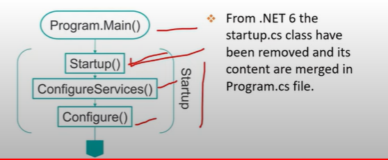
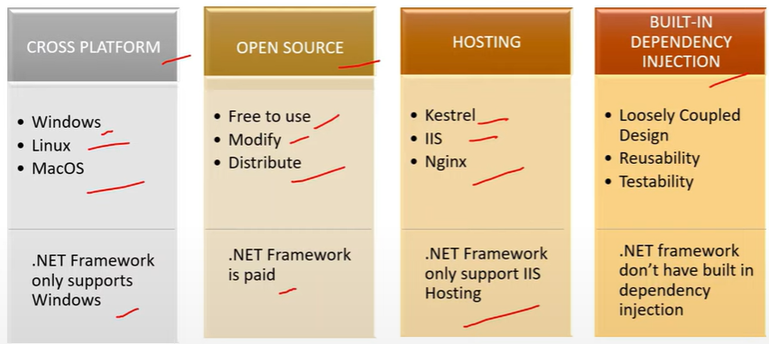
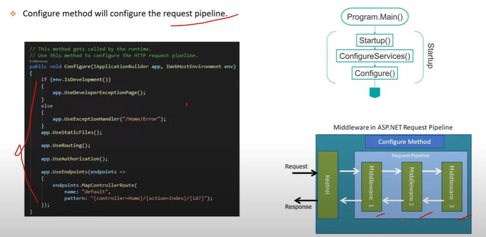
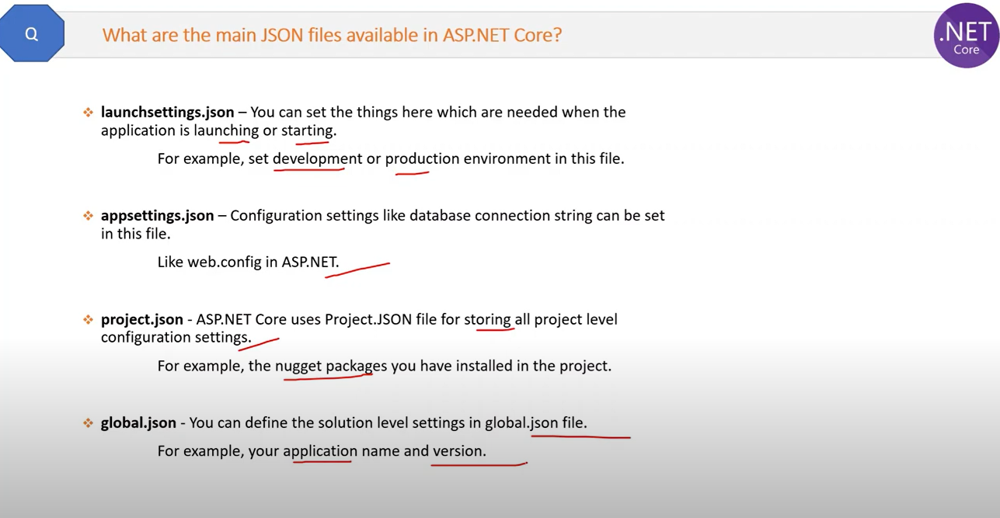
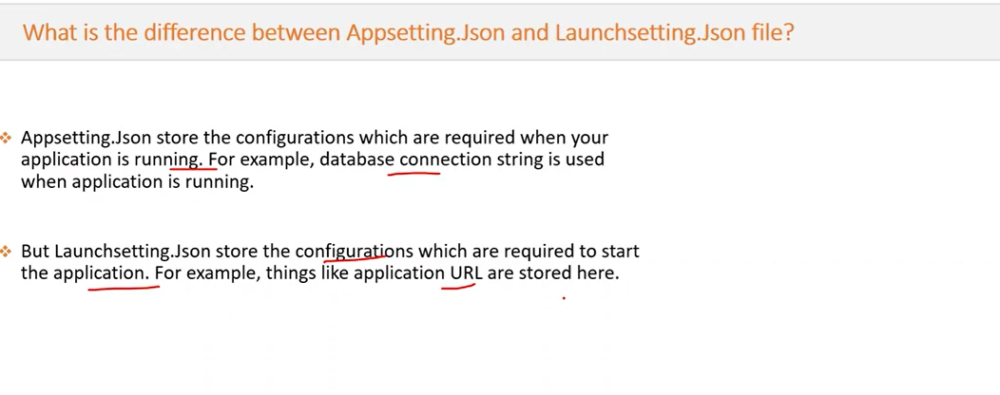
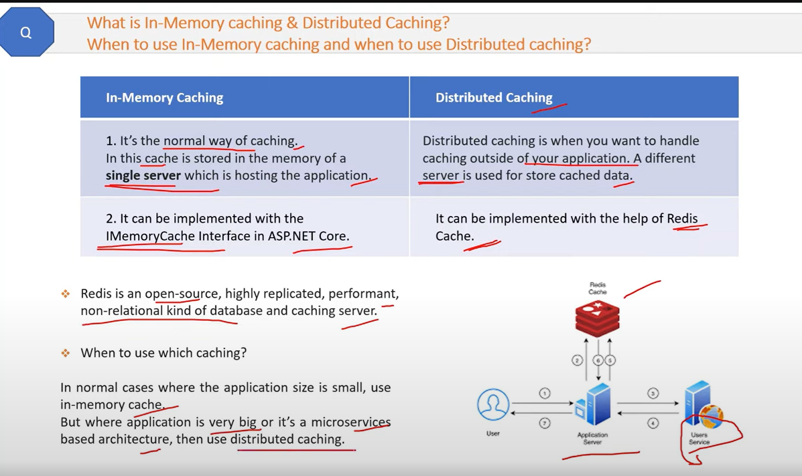

## What is .NET Core?

- It is new framwork which is free and open source platform developed and maintained by microsoft.

## What is .NET Standard?

- .NET Standard is not a framework.
- .NET Standard defines `a set of rules` which if any base class library of any framework will follow then the framework will be called .NET Standard compliant.

## What is the role of Startup.cs?

1. Startup Constructor:
- It will set the configuration related things with IConfiguration interface.

```
public Startup(IConfiguration configuration)
{
    Configuration = configuration;
}
```
Example: If you have database configuration like connection strings in app settings file then you will get it using configuration.

2. ConfigureServices():
- This method configures `SERVICES` which are required by the application.

```
public void ConfigureServices(IServiceCollection services)
{
    services.AddControllers();
    services.AddScoped<IProductAgent, ProductAgent>();
}
```

3. Configure():
- This method defines the application REQUEST HANDLING PIPELINE as a series of middleware components.

```
public void Configure(IApplicationBuilder app)
{
 app.UseRouting();
 app.UseEndpoints(endpoints => {
                endpoints.MapDefaultControllerRoute();
                endpoints.MapControllerRoute("default", "{controller=Home}/{action=Index}/{id?}");
}
``` 


---

## What are the advantages of .NET Core over .Net framework?



**Note:**
- .Net framework is free not visual studio

---

## What is the role of Configure method?

- Configure method will configure the request pipeline.



## What is dependency injection?

- 

---
## What are the main JSON files available in ASP.NET Core?






---



---

https://www.youtube.com/watch?v=hcKrok1oZtQ&t=14s


In ASP.NET Core, filters are components that can be used to implement cross-cutting concerns in an MVC application. Filters are used to perform actions before or after the execution of controller action methods or after the completion of the entire request. Filters can be applied globally, at the controller level, or at the action method level.

There are several types of filters in ASP.NET Core, and they can be overridden using specific attributes or by implementing corresponding interfaces. Here are some commonly used filters and their corresponding overrides:

### 1. **Authorization Filters:**
   - **Purpose:** To control access to action methods.
   - **Override:** Implement the `IAuthorizationFilter` interface or use the `[Authorize]` attribute.

   ```csharp
   [Authorize]
   public class MyController : Controller
   {
       // Action methods...
   }
   ```

### 2. **Action Filters:**
   - **Purpose:** To perform logic before and after the execution of an action method.
   - **Overrides:** Implement the `IActionFilter` interface or use attributes like `[HttpGet]`, `[HttpPost]`, etc.

   ```csharp
   public class MyActionFilter : IActionFilter
   {
       public void OnActionExecuting(ActionExecutingContext context)
       {
           // Logic before the action method execution.
       }

       public void OnActionExecuted(ActionExecutedContext context)
       {
           // Logic after the action method execution.
       }
   }
   ```

   ```csharp
   [ServiceFilter(typeof(MyActionFilter))]
   public class MyController : Controller
   {
       // Action methods...
   }
   ```

### 3. **Result Filters:**
   - **Purpose:** To perform logic before and after the execution of the result (after the action method).
   - **Overrides:** Implement the `IResultFilter` interface.

   ```csharp
   public class MyResultFilter : IResultFilter
   {
       public void OnResultExecuting(ResultExecutingContext context)
       {
           // Logic before the result is executed.
       }

       public void OnResultExecuted(ResultExecutedContext context)
       {
           // Logic after the result is executed.
       }
   }
   ```

   ```csharp
   [ServiceFilter(typeof(MyResultFilter))]
   public class MyController : Controller
   {
       // Action methods...
   }
   ```

### 4. **Exception Filters:**
   - **Purpose:** To handle exceptions thrown during the execution of an action method.
   - **Overrides:** Implement the `IExceptionFilter` interface or use the `[ExceptionHandler]` attribute.

   ```csharp
   public class MyExceptionFilter : IExceptionFilter
   {
       public void OnException(ExceptionContext context)
       {
           // Handle the exception.
       }
   }
   ```

   ```csharp
   [ServiceFilter(typeof(MyExceptionFilter))]
   public class MyController : Controller
   {
       // Action methods...
   }
   ```

### 5. **Resource Filters:**
   - **Purpose:** To perform logic before and after the execution of an action but before model binding.
   - **Overrides:** Implement the `IResourceFilter` interface.

   ```csharp
   public class MyResourceFilter : IResourceFilter
   {
       public void OnResourceExecuting(ResourceExecutingContext context)
       {
           // Logic before the action method and model binding.
       }

       public void OnResourceExecuted(ResourceExecutedContext context)
       {
           // Logic after the action method and model binding.
       }
   }
   ```

   ```csharp
   [ServiceFilter(typeof(MyResourceFilter))]
   public class MyController : Controller
   {
       // Action methods...
   }
   ```

These filters provide a way to modularize and reuse cross-cutting concerns in your ASP.NET Core application. You can apply them at various levels (controller, action method, or globally) based on your specific requirements.