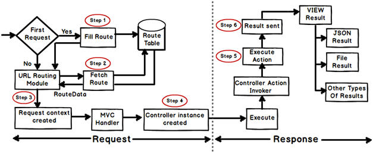

Reference: https://www.codeproject.com/Articles/556995/ASP-NET-MVC-Interview-Questions-with-Answers

## What is MVC (Model View Controller)?

- MVC is an `architectural pattern` which separates the representation and user interaction.
-  It’s divided into three broader sections, Model, View, and Controller.
- The View is responsible for the look and feel.
- Model represents the real world object and provides data to the View.
- The Controller is responsible for taking the end user request and loading the appropriate Model and View.


## Explain MVC application life cycle?

Any web application,
 - understanding the request
 - depending on the type of the request sending out appropriate response.

It has two main phases, 
- creating the request object
- sending our response to the browser




`Step 1 Fill route:` - MVC requests are mapped to route tables which in turn specify which controller and action to be invoked. So if the request is the first request the first thing is to fill the route table with routes collection. This filling of route table happens in the global.asax file.

`Step 2 Fetch route:` - Depending on the URL sent “UrlRoutingModule” searches the route table to create “RouteData” object which has the details of which controller and action to invoke.

`Step 3 Request context created:` - The “RouteData” object is used to create the “RequestContext” object.
---

## MediaTypeFormatter
In ASP.NET MVC, `MediaTypeFormatter` is a class responsible for handling the serialization and deserialization of data between the server and the client. It plays a crucial role in formatting the HTTP request and response bodies based on the content type specified in the request headers. `MediaTypeFormatter` is part of the Web API framework, and it's commonly used to handle content negotiation.

Here's a brief overview of `MediaTypeFormatter` in ASP.NET MVC:

1. **Content Negotiation:**
   - Content negotiation is the process by which the server selects the appropriate `MediaTypeFormatter` based on the client's request headers (Accept header).
   - The selected formatter is responsible for serializing the response data into the requested format.

2. **Built-in Formatters:**
   - ASP.NET MVC comes with several built-in `MediaTypeFormatter` implementations for common formats like JSON and XML.
   - Examples include `JsonMediaTypeFormatter` and `XmlMediaTypeFormatter`.

3. **Custom Formatters:**
   - Developers can create custom `MediaTypeFormatter` implementations to support additional content types or customize the serialization/deserialization process.
   - Custom formatters need to inherit from the `MediaTypeFormatter` class and override specific methods.

4. **Configuration:**
   - `MediaTypeFormatter` instances are configured in the `Global.asax.cs` file or through the `WebApiConfig` class in Web API projects.
   - Configuration includes adding formatters to the `Formatter` collection of the `HttpConfiguration` object.

   Example Configuration:
   ```csharp
   // Global.asax.cs or WebApiConfig.cs
   GlobalConfiguration.Configuration.Formatters.Add(new JsonMediaTypeFormatter());
   GlobalConfiguration.Configuration.Formatters.Add(new XmlMediaTypeFormatter());
   ```

5. **Handling Requests and Responses:**
   - `MediaTypeFormatter` is responsible for serializing response data into the desired format before sending it to the client.
   - It also handles deserialization of request data, converting the incoming payload into the appropriate object type.

   Example Controller Action:
   ```csharp
   public IHttpActionResult Get()
   {
       var data = // retrieve data from a data source
       return Ok(data); // Serialization handled by MediaTypeFormatter
   }
   ```

6. **Content Negotiation Attributes:**
   - Developers can use content negotiation attributes like `[Produces]` and `[Consumes]` to specify the supported content types for an action method.

   Example:
   ```csharp
   [Produces("application/json", "application/xml")]
   public IHttpActionResult Get()
   {
       // ...
   }
   ```

`MediaTypeFormatter` is a crucial component for building RESTful APIs in ASP.NET MVC, and it ensures that the server and client can communicate effectively by supporting various content types based on client preferences.