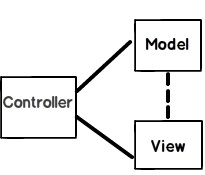

Reference: https://www.codeproject.com/Articles/556995/ASP-NET-MVC-Interview-Questions-with-Answers

## What is MVC (Model View Controller)?

- MVC is an `architectural pattern` which separates the representation and user interaction.
-  It’s divided into three broader sections, Model, View, and Controller.
- The View is responsible for the look and feel.
- Model represents the real world object and provides data to the View.
- The Controller is responsible for taking the end user request and loading the appropriate Model and View.

## Explain MVC application life cycle?

Any web application,
 - understanding the request
 - depending on the type of the request sending out appropriate response.

It has two main phases, 
- creating the request object
- sending our response to the browser

`Step 1 Fill route:` - MVC requests are mapped to route tables which in turn specify which controller and action to be invoked. So if the request is the first request the first thing is to fill the route table with routes collection. This filling of route table happens in the global.asax file.

`Step 2 Fetch route:` - Depending on the URL sent “UrlRoutingModule” searches the route table to create “RouteData” object which has the details of which controller and action to invoke.

`Step 3 Request context created:` - The “RouteData” object is used to create the “RequestContext” object.

