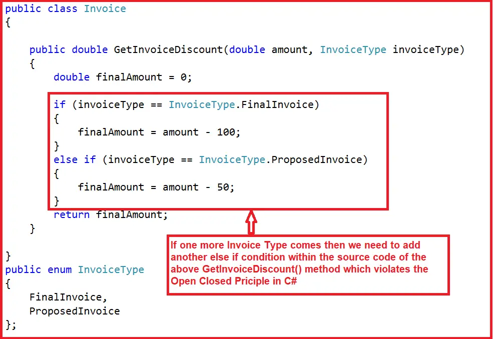

# SOLID Principle

1. S - Single Responsibility principle
2. O - Open-closed principle
3. L - Liskov substitution principle
4. I - Interface segregation principle
5. D - Dependancy Inversion principle

__Reference__: https://dotnettutorials.net/lesson/open-closed-principle/

## Benefits of SOLID Principles
- Loose coupling
- Code maintainability
- Dependancy management
- It makes code easier to understand 
- It helps in adding new features without breaking existing ones.
- It simplifies the testing.
- Reduces the chance of introducing bugs

---
## Singile responsibility principle
- A class should do only one job or only one reason to change
- Example 1:
    - If you have a class for handling user authentication then it should focus only on authentication.
    - And `not` handle or include other unrelated tasks like sending emails.
- Exmaple 2:


```
public class Invoice {

    public void AddInvoice(){
        //Add invoice logic
        SendEmail();
    }

    public void DeleteInvoice(){
        //Add Delete logic 
    }
    public void SendEmail(){
        // Add mail logic
    }
}
```


```
public static class Email{
    public static void SendEmail(){

    }
}
public class Invoice {

    public void AddInvoice(){
        //Add invoice logic
        Email.SendEmail();
    }

    public void DeleteInvoice(){
        //Add Delete logic 
    }    
  
```
---

## Open Closed Principle (OCP):

- It states that software component such as classes, methods should be `open` for `extension` but `closed` for `modification`
- Example: Imagine a shape-drawing system. If you want to add a new shape, like a triangle, you shouldn't have to modify the existing code for circles and squares.
- The `Open for Extension` means we must design the software modules/classes/functions so that the new responsibilities or functionalities can be added easily when new requirements come. On the other hand, 
- `Closed for Modification` means we should not modify the class/module/function until we find some bugs.
- In simple words, we can say that we should develop one Class/Module/Function in such a way that it should allow its behavior to be extended without altering its source code. 
- That means we should not edit the code of a method (until we find some bugs); instead, we should use polymorphism or other techniques to add new functionality by writing new code.
- The easiest way to implement the Open-Closed Principle in C# is to add new functionalities by creating new derived classes, which should be inherited from the original base class.



```
public class Invoice{
    public double GetInvoiceDiscount(double amount, InvoiceType invoiceType)
    {
        double finalAmount = 0;
        if(invoiceType == InvoiceType.FinalInvoice){
            finalAmount = amount - 100;
        }   
        else if(invoiceType == InvoiceType.ProposedInvoice){
            finalAmount = amount - 50;            
        }        
    }
    public enum InvoiceType{
        FinalInvoice,
        ProposedInvoice
    }
}
```
 - We have two Invoice Types, i.e., Final Invoice and Proposed Invoice. So, we have implemented the logic using the if-else condition.
- Tomorrow, if one more Invoice Type comes into the picture, we need to modify the GetInvoiceDiscount() method logic by adding another if block to the source code.

Example wth OCP:

```

public class Invoice{
    public virtual double GetInvoiceDiscount(double Amount){
        return amount - 0;
    }
}

public class FinalInvoice: Invoice{
    public virtual double GetInvoiceDiscount(double Amount){
        return amount - 100;
    }
}

public class ProposedInvoice: Invoice{
    public override double GetInvoiceDiscount(double amount){
        return amount - 50;
    }    
}

public class RecurringInvoice: Invoice{
    public override double GetInvoiceDiscount(double amount){
        return amount - 40;
    }
}
```
or

```
public interface IInvoice{
    GetInvoiceDiscount(double amount)
}

public class FinalInvoice: IInvoice{
      public virtual double GetInvoiceDiscount(double Amount){
        return amount - 100;
    } 
}

public class ProposedInvoice: IInvoice{
      public virtual double GetInvoiceDiscount(double Amount){
        return amount - 50;
    } 
}

public class RecurringInvoice: IInvoice{
      public virtual double GetInvoiceDiscount(double Amount){
        return amount - 50;
    } 
}
```
---

## Liskov Substitition

- Object of a Derived classes must be replace with object of base classes without any errors in the systems or modifying behaviour of base class.
- If S is subtype of T, then objects of type T may be replaced(or substituted) with objects of type S.

Violating Liskov Substitution Principle:

```
using System;

class Bird
{
    public virtual void Fly()
    {
        Console.WriteLine("A bird is flying");
    }
}

class Sparrow : Bird
{
    public override void Fly()
    {
        Console.WriteLine("A sparrow is flying");
    }
}

class Penguin : Bird
{
    public override void Fly()
    {
        // Penguins can't fly, violating LSP
        throw new InvalidOperationException("Penguins can't fly");
    }
}

class Program
{
    static void MakeBirdFly(Bird bird)
    {
        bird.Fly();
    }

    static void Main()
    {
        Bird sparrow = new Sparrow();
        Bird penguin = new Penguin(); // This violates LSP

        MakeBirdFly(sparrow); // Outputs: "A sparrow is flying"
        
        try
        {
            MakeBirdFly(penguin); // Throws an exception due to LSP violation
        }
        catch (Exception ex)
        {
            Console.WriteLine($"Error: {ex.Message}");
        }
    }
}

```
Following Liskov Substitution Principle:
```
using System;

// Base class
class Bird
{
    public virtual void Fly()
    {
        Console.WriteLine("A bird is flying");
    }
}

// Subclass 1
class Sparrow : Bird
{
    public override void Fly()
    {
        Console.WriteLine("A sparrow is flying");
    }
}

// Subclass 2
class Penguin : Bird
{
    public void Swim()
    {
        Console.WriteLine("A penguin is swimming");
    }
}

class Program
{
    static void MakeBirdFly(Bird bird)
    {
        bird.Fly();
    }

    static void Main()
    {
        Bird sparrow = new Sparrow();
        Bird penguin = new Penguin();

        MakeBirdFly(sparrow); // Outputs: "A sparrow is flying"
        
        // No violation of LSP here, as we're not trying to make the penguin fly
        ((Penguin)penguin).Swim(); // Outputs: "A penguin is swimming"
    }
}

```
- In this example, both Sparrow and Penguin are valid substitutes for the base class Bird. The Penguin class doesn't override the Fly method, which is appropriate since penguins cannot fly. It follows the Liskov Substitution Principle by providing a specialized behavior (Swim in this case) without breaking the expected behavior of the base class.

---

## Interface Segregation

- This principle suggests that it is better to have multiple small, specific interfaces rather than a large one.
- Clients should not be forced to implement any methods they don’t use.

Problem:


- Example using Interface Segregation Principle in C#:
- As you can see in the image below, we have split that big interface into three small interfaces. Each interface now has some specific purpose. 

 

- Now, if any class wants all the printer services, then that class needs to implement all three interfaces. In our example, HPLaserJetPrinter wants all the printer services. So, the HPLaserJetPrinter class needs to implement all three interfaces and provide implementations of all interface methods, as shown in the below image.


- Now, if any class wants the Scan and Print services, then that class needs to implement only the IPrinterTasks interfaces. In our example, LiquidInkjetPrinter wants only the Scan and Print services. So, the LiquidInkjetPrinter class must implement only the IPrinterTasks interfaces and provide implementations for Print and Scan methods, as shown in the image below.


---

## Dependency Inversion Principle (DIP)

- High-level modules should not depend on low-level modules. Both should depend on abstractions.
- Abstractions should not depend on details; details should depend on abstractions.
- This principle encourages the use of dependency injection and inversion of control to achieve a more flexible and decoupled design.

```
using System;

// Low-level module
interface IMessageSender
{
    void SendMessage(string message);
}

class EmailSender : IMessageSender
{
    public void SendMessage(string message)
    {
        Console.WriteLine($"Sending email: {message}");
    }
}

class SMSSender : IMessageSender
{
    public void SendMessage(string message)
    {
        Console.WriteLine($"Sending SMS: {message}");
    }
}

// High-level module
class NotificationService
{
    private IMessageSender _messageSender;

    // Dependency is injected through constructor
    public NotificationService(IMessageSender messageSender)
    {
        _messageSender = messageSender;
    }

    public void SendNotification(string message)
    {
        // High-level module depends on the abstraction (IMessageSender), not the concrete class
        _messageSender.SendMessage(message);
    }
}

class Program
{
    static void Main()
    {
        // Low-level modules (EmailSender and SMSSender) can be easily swapped without changing NotificationService
        IMessageSender emailSender = new EmailSender();
        IMessageSender smsSender = new SMSSender();

        NotificationService emailNotificationService = new NotificationService(emailSender);
        NotificationService smsNotificationService = new NotificationService(smsSender);

        emailNotificationService.SendNotification("Hello via Email");
        smsNotificationService.SendNotification("Hello via SMS");
    }
}

```

In this example:

- `IMessageSender` is the abstraction (interface) representing the `low-level` module responsible for sending messages.
- `EmailSender and SMSSender` are concrete implementations of IMessageSender.
- `NotificationService` is the `high-level` module that depends on the abstraction (IMessageSender). It receives an IMessageSender through its constructor, following the Dependency Injection pattern.

- By adhering to DIP, the NotificationService is `not` directly tied to specific implementations (EmailSender or SMSSender).
- You can easily swap out one implementation for another without modifying the high-level module, promoting flexibility and maintainability.