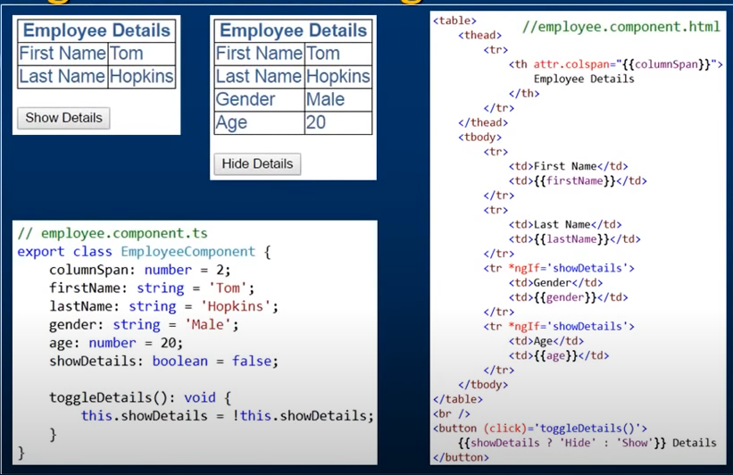

#Angular Questions and Answers

## Q1. Latest version of Angular ?  Some times they may ask the comparison between two versions which you have used

The latest stable version of Angular was **Angular 13**, which was released in November 2022

- When you're dealing with migration between two versions of a framework like Angular, it's essential to understand the changes introduced in each version. Angular provides release notes for each version, and these release notes can help you identify breaking changes, new features, and other modifications.

- Here are the general steps you can follow to compare two versions of Angular for migration purposes:

1. **Review Release Notes:**
   - Visit the official Angular GitHub repository or the Angular website.
   - Look for the release notes section or release announcements.
   - Read the release notes for the specific versions you are comparing.
   - Pay attention to the "Breaking Changes" section, as this will highlight any changes that might impact your existing code.

2. **Check the Changelog:**
   - In addition to release notes, explore the changelog for each version.
   - The changelog provides a detailed list of changes, bug fixes, and enhancements made in each release.

3. **Use Migration Guides:**
   - Angular often provides migration guides for major version upgrades.
   - Check for migration guides relevant to the versions you are moving from and to. These guides offer step-by-step instructions for updating your code.

4. **Check Deprecated Features:**
   - If any features or APIs are deprecated in the older version, check whether they have been removed or replaced in the newer version.
   - Update your code to use the recommended alternatives.

5. **Use Tools for Automated Checks:**
   - Consider using tools like `ng update` provided by the Angular CLI to automate some of the update tasks.
   - The Angular Update Guide (https://update.angular.io/) is a helpful online tool that provides guidance on updating Angular projects between different versions.

6. **Test Your Application:**
   - Set up a test environment and migrate a copy of your application.
   - Test thoroughly to ensure that the application behaves as expected with the new version.
   - Pay special attention to any areas identified in the release notes as potential breaking changes.

7. **Check Third-Party Dependencies:**
   - If your project relies on third-party libraries or modules, check their documentation and release notes for compatibility with the target Angular version.


**Note:** Remember that migration steps may vary based on the specifics of your application and the changes introduced in the versions you're migrating between. Always make sure to back up your codebase before performing any significant updates, and follow best practices for version control to track changes effectively.

---
## Q2. What is Angular CLI

- The Command Line Interface.
- It is a tool provided by the Angular framework to simplify and automate common development tasks.
- It allows developers to __create, build, test, and manage__ Angular projects more efficiently.
- With commands like,
  - 'ng new' for project creation
  - 'ng generate' for code scaffolding
  - 'ng server' inclues development server that allows you to run your application locally
  - 'ng test' for testing

---
## Q3. Angular Lifecycle hooks

- In Angular, think of a component's lifecycle like its `journey` from being born/created to being removed.
- Along this journey, Angular provides specific points where you can do certain things.
- These points are the lifecycle hooks. 
- For example, 
  - When the component is created, you can set it up with __ngOnInit()__. 
  - If it has data that might change, __ngOnChanges()__ lets you react to those changes. 
  - And before saying goodbye, you get a chance to clean up any mess with __ngOnDestroy()__
- These hooks give you control over what happens at different stages of a component's life.
 
Here are the main lifecycle hooks in Angular:

1. __ngOnChanges():__

    - `Called before ngOnInit()`
    - This hook is called when an (data-bound) `input property` of the component changes.
    - It receives a SimpleChanges object containing the previous and current values of the input properties.
    - Called **multiple times** only if input property changes.
    - NOTE: 
      - If your component has `no inputs` or you use it without providing any inputs, the framework `will not` call ngOnChanges().
      - This happens frequently, so any operation you perform here impacts `performance` significantly.

2. __ngOnInit():__

    - This hook is called once when the `component is initialized`.
    - ngOnInit signals the activation of the created component.
    - It is commonly used for `initializing data, making API calls, or performing other setup tasks`.
    - ngOnInit **`called only once`** during lifecycle

3. ngDoCheck():
    - Called immediately after ngOnChanges() on every change detection run, 
    - For the first time of initialization of application, immediately after ngOnInit().
      - ngOnChanges() -> ngOnInit -> ngDoCheck()

4. ngAfterContentInit():

    - This hook is called once after the component's content has been initialized.
    - Respond after Angular projects external content into the component's view
    - It is used when a component has projected content (content projection using <ng-content>).
    - Called once after the `first ngDoCheck()`.

5. ngAfterContentChecked():

    - This hook is called after every check of the component's content.
    - It is used for additional checks or operations after the content is updated.
    - Called after ngAfterContentInit() and every subsequent ngDoCheck().

6. ngAfterViewInit():

    - This hook is called once after the component's view and its child views are initialized.
    - It is often used when you need to `interact with the DOM or perform operations that depend on the component's view`.
    - Called once after the first ngAfterContentChecked()

7. ngAfterViewChecked():

    - This hook is called after every check of the component's view and its child views.
    - It can be used for additional checks or operations after the view is updated.
    - Called after the ngAfterViewInit() and every subsequent ngAfterContentChecked()

8. __ngOnDestroy():__

    - This hook is called just before the component/directive is destroyed.
    - It is used for cleanup tasks, such as unsubscribing from observables to prevent memory leaks.

---
## Q4. Constructor and NgOnInit and it's differences

```
export class App implements OnInit{
  constructor(private myService: MyService){
     //called first time `before` the ngOnInit()
  }

  ngOnInit(){
     //called `after` the constructor and called  after the first ngOnChanges()
     //e.g. http call...
  }
}
```
- The `Constructor` is a default method of the class that is executed when the class is instantiated.
- The constructor should only be used to initialize class members but shouldn't do actual "work". 
- Constructor is widely used to `inject dependencies(services)` into the componenet class.
- `ngOnInit` is an Angular lifecycle hook, specifically designed for Angular components.
- Mostly we use ngOnInit for initialization logic, such as making HTTP requests, initializing component properties based on input values, or performing other setup tasks. and avoid stuff to work in the constructor. 
---
## Q5. What is HttpClient in angular?
- This client is available from `@angular/common/http` package.
```
import { HttpClientModule } from '@angular/common/http;'
```
- It is a service for making HTTP requests to a server. 
- It's helps your Angular application communicate with a backend. 
- With HttpClient, you can easily fetch data, send data, and handle responses from a server. 
- It's a crucial part of building modern web applications that need to interact with servers to get or send data.

**Key features and functionalities of HttpClient include: -**

1. Making HTTP Requests:

  - HttpClient provides methods for making various types of HTTP requests, such as GET, POST, PUT, DELETE, etc.
Example of making a GET request:

```
import { HttpClient } from '@angular/common/http';

constructor(private http: HttpClient) { }

fetchData() {
  return this.http.get('https://api.example.com/data');
}
```
2. Handling Responses:

- HttpClient returns an observable for handling asynchronous responses. Developers can subscribe to these observables to receive and process the data.
```
fetchData() {
  this.http.get('https://api.example.com/data').subscribe(
    (data) => {
      // Handle successful response
      console.log(data);
    },
    (error) => {
      // Handle error
      console.error(error);
    }
  );
}
```
3. Request Configuration:

- HttpClient allows you to configure requests with options like headers, query parameters, and more.
```
const options = {
  headers: new HttpHeaders({
    'Content-Type': 'application/json',
    'Authorization': 'Bearer ' + authToken
  })
};

this.http.post('https://api.example.com/submit', data, options);
```
4. Interceptors:

- Interceptors can be used with HttpClient to intercept and modify HTTP requests or responses globally. This is useful for tasks like adding authentication headers or handling errors.
5. Typed Responses:

- HttpClient supports the ability to define the expected type of the response using generics, making it easier to work with strongly-typed data.
```
interface UserData {
  name: string;
  email: string;
}

this.http.get<UserData>('https://api.example.com/user').subscribe(user => console.log(user));
```
6. Testing:

- HttpClientTestingModule is provided in Angular for testing HTTP requests and responses in a controlled environment.
---
## Q6. Explain on how to use `HttpClient` with an example?

Below are the steps need to be followed fot the usage of `HttpClient`

1. Import `HttpClient` into root module:
```
import { HtttpClientModule } from '@angular/common/http'

@NgModule({
  imports: [
    BrowserModule,
    //Import HttpClientModule after BrowserModule
    HttpClientModule,
  ],
.......
})

export class AppModule {}
```

2. Inject the `HttpClient` into the application: Let's create a userProfileService(userProfile.servie.ts) as an example. It also defines get method of HttpClient:
```
import { Injectable } from '@angular/core';
import { HttpClient } from '@angular/common/http';

const userProfileUrl: string = 'assests/data/profile.json';

@Injectable()
export class UserProfileService {
  constructor(private http: HttpClient) {}

  getUserProfile(){
    return this.http.get(this.userProfileUrl);
  }
}
```

3. Create component for subscribing service: Let's create a component called UserProfileComponent(userprofile.component.ts), which injects UserProfileService and invokes the service method:

```
fetchUserProfile(){
  this.userProfileService.getUserProfile()
  .subscribe(
    (next: User) => this.user = {
      id: data['userid'],
      name: data['name']
    }
  )
}
```
- Since the above service method returns an Observable which needs to be subscribed in the component.
---
## Q7. What is Observables? subscribe and unsubscribe from Observables

### [Observables](https://rxjs.dev/guide/observable)

```
import { Observable } from 'rxjs'

const myObservable = new Observable(observer => {
  observer.next('Hello');
  observer.next('World');
  observer.complete();
});
```

- In Angular, we use Observables to handle things that might take time, like getting data from the internet.
- Basically it Used to perform async operations and handle async data.
- `rxjs` (Reactive Extension for JavaScript) library is commonly used in Angular for working with observables.
- It is representation of stream of data
- It can emit data over time.
- Observables can be used to handle events, handle async operations and manage data streams.

In real world example,
- Think of an Observable like a `magic mailbox`. 
- This mailbox can send you messages over time. 
- You can sit there and wait for new messages. 
- When a message arrives, you react to it—maybe you laugh, maybe you cry.

- Now, `subscribing to an Observable` is like checking your mailbox regularly. 
- You're saying, 'Hey, if there's a new message, let me know, and I'll react to it.' 
- If you get tired of waiting or you don't want messages anymore, you can `unsubscribe`. It's like saying, 'Okay, magic mailbox, I'm done listening for now.'

### Subscribe
- To listen observables and react to the data it emits, you can use `subscribe` method.
- The `subscribe` method takes one or more functions as arguments. These functions define what should happen when the observable emits a new value, encounters an error or completes.
- Example:
```

const subscription = myObservable.subscribe(
  next => console.log(next),         // Next function
  error => console.error(error),       // Error function
  () => console.log('Observable completed')  // Complete function
);
```
or
```
const subscription = myObservable.subscribe({
  next(value) { console.log(next) },
  error(err) { console.log(err) },
});
```
### Unsubscribe
- It's recommended to unsubscribe the observable to prevent `memory leaks`.
- The subscribe method returns a subscription object. Calling the unsubscribe method on this object terminates the subscription and cleans up resources.
```
import { Observable } from 'rxjs';

const myObservable = new Observable(observer => {
  const intervalId = setInterval(() => {
    observer.next('Hello');
  }, 1000);

  // Cleanup logic when unsubscribed
  return () => {
    clearInterval(intervalId);
    console.log('Observable unsubscribed');
  };
});

const subscription = myObservable.subscribe(value => console.log(value));

// Later, when you want to unsubscribe
subscription.unsubscribe();
```
---
## Q8. Promise vs Observable

Reference: https://www.youtube.com/watch?v=Wz8X4YBrMoI&list=PLbDH2D6bQCl1lCLachXihVpxsFMktiT6S

---
## Q9. JIT and AOT compilation? And may be it's advantages

### JIT
- Just in Time compiler
- JIT compiles the application in the browser at `runtime`

 

- Here we have build and runtime environment.
- In the build environment we are having source code, we are not compiling the code here.
- We are sending code to the browser and this runtime environment happening on browser side.
- At browser side, JIT comiler compiles the code and convert it into Javascript in order to reder. 

### AOT
- Ahead of Time Compiler
- AOT compiles the application at `build` time

 

- Here angular code will compiles the code at build time.
- Once code is build, then after that build code goes to browser to rednder. 

### Difference

No.|JIT|AOT|
--- | --- | ---
1|Compile at runtime in the browser|Compile at build time|
2|Larger angular bundle file size|Smaller angular bundle file size|
3|Detect template error at runtime|Detect template errors at compile time|
4|Good for Development|Good for production|
5|ng serve|ng build --aot or ng build --prod|
6|Less security and Performance|Better security and Performance|

__Note:__
- Reference: https://www.youtube.com/watch?v=nq5z5YZHAKE
---
## Q.9 What is rxJS and their behavior?

- RxJS, or Reactive Extensions for JavaScript
- It is a library that provides a set of tools for reactive programming using Observables.
- Using this library you can work with asynchronous data streams.

### Key Concepts in RxJS:

1. Observables:
    - Observables represent a stream of data or events that can be observed over time.
    - They can emit multiple values asynchronously and are a fundamental part of RxJS.
2. Observers:
    - Observers subscribe to Observables to receive notifications when new data is emitted.
    - Observers consist of three callbacks: next (handles new values), error (handles errors), and complete (handles the completion of the Observable).
3. Operators:
    - Operators are functions that can be applied to Observables to transform, filter, or combine the data emitted by them.
    - Examples: map, filter, merge, switchMap, etc.
4. Subscription:
    - A Subscription represents the execution of an Observable and manages the disposal of resources when the Observer no longer needs the data.

### Behavior of RxJS:
- Asynchronous Data Handling
- Event Handling
- Error Handling
---
## Q.10 Eager and Lazy loading in angular?

- Eager Loading:
  - When the application starts, eager loading `loads the entire app upfront`, including all its features and components.
  - Example, In our cooking app, if all the recipes for appetizers, main courses, and desserts are loaded as soon as you open the app, it's using eager loading. 
  - This ensures everything is ready, but it might take longer to start.  
- Lazy loading:
  - Instead of loading the entire application at once, lazy loading `loads specific parts of the application` only when the user navigates to them.
  - Examople, Imagine you're using a cooking app, and the recipes for desserts are loaded only when you click on the "Desserts" section. 
  - Lazy loading helps make your app faster by loading only what's necessary when it's needed.

---
## Q.11 What is NgModule?

- NgModule is a way of organizing and grouping related components, directives, pipes and services in an Angular application.

- Suppose we have a basic application with a component, a service, and a module.

1. Create a Component:

```
// app.component.ts
import { Component } from '@angular/core';

@Component({
  selector: 'app-root',
  template: '<h1>Hello, {{ name }}!</h1>',
})
export class AppComponent {
  name = 'Angular';
}
```
2. Create a Service:

```
// greeting.service.ts
import { Injectable } from '@angular/core';

@Injectable({
  providedIn: 'root',
})
export class GreetingService {
  getGreeting(): string {
    return 'Welcome to Angular World!';
  }
}

```
3. Create an NgModule:
```
// app.module.ts
import { NgModule } from '@angular/core';
import { BrowserModule } from '@angular/platform-browser';

import { AppComponent } from './app.component';
import { GreetingService } from './greeting.service';

@NgModule({
  declarations: [
    AppComponent,
  ],
  imports: [
    BrowserModule,
  ],
  providers: [
    GreetingService,
  ],
  bootstrap: [AppComponent],
})
export class AppModule { }

```
In this example:
- The `AppComponent` is a simple component displaying a greeting.
- The `GreetingService` is a service providing a method to get a greeting message.
- The `AppModule` is the main module of the application.
  - It declares the `AppComponent` in the `declarations` array.
  - It imports the `BrowserModule` in the `imports` array.
  - It provides the `GreetingService` in the `providers` array.
  - It specifies that the `AppComponent` should be bootstrapped in the bootstrap array.
---

## Q12. Var and Let

- let
    - `Block-scoped`: Variables declared with let are accessible to the block (enclosed in curly braces) where they are defined.
    - Cannot be redeclared within the same scope.
    - Hoisted to the top of the block but not initialized until the declaration is encountered.
- var
    - `Function-scoped`: Variables declared with var are visible throughout the entire function.
    - Can be redeclared within the same scope.
    - Hoisted to the top of the function and initialized.
```
fuction example(){
  if(true)
  {
    var x = 10;
    let y = 20;

    console.log(x);  //10
    console.log(y);  //20
  }

  console.log(x);  //10
  // console.log(y);  // ReferenceError: y is not defined
}
```
Note: 
- In modern JavaScript, it is generally recommended to use `let and const` over `var` due to their block-scoping behavior, which helps prevent certain types of bugs and makes code more predictable. 
- `const` is used for constants, and `let` is used for variables whose values can be reassigned.

---

## Q13. Angular dependency injection?

Reference: https://www.youtube.com/watch?v=jWODteEGQmw


- In above example, EmployeeService is responsible for fetching all the data, we could resue this in other component. 
- We are not creating instance of EmployeeService. We are only initializing private field and assign it in constructor. 
- We are not using new keyword. So questions is how we are getting the instace of EmployeeService.

```
export class EmployeeListComponent implements OnInit{
  private _empService: EmployeeService;

  constructor(_empService: EmployeeService){
    this._empService = _empService;
  }

  ngOnInit(){
    this._empService.getEmployees()
        .subscribe(
          (next) => this.employees = next;
          (error) => this.message = 'Error';
        )
  }
}
```
- Who is creating and providing an instance to the Component?
    - `Angular injector`
    - When an instance comopnent is created Angular injector create an instacne of EmployeeService and injects that into the constructor

- How does the angular injector knows about EmployeeService?     
    - By register a service within the angular injector we could use `providers` property of `NgModule` or `Component` decorator.
    - Register at module level or component level


---

## Q14. Component in Angular
```
import { Component }`angular/core`;

@Component({
  selector: 'my-app',
  template: `Hello My World!!!`
})

export class AppComponent{
  name: string = 'Angular';
}
```


---

## Q15. Data Binding / Angular Interpolation

- Data Binding ways:
  - One way data-binding
    - From component to view template
  - One way data-binding
    - From view template to component
  - Two way data-binding
    - From component to view and vice versa.

- `One way data binding` from component to view can be achieved using `Angular Interpolation.`

- `One way data-binding` - From `Component to View Template` : To display read-only data on a view template we use one-way data binding technique `interpolation`. 
  - With interpolation, we place the component property name in the view template, enclosed in double curly braces: {{propertyName}}.

Example:
- In the following example, Angular pulls the value of the firstName property from the component and inserts it between the opening and closing [h1] element.

```
import { Component } from '@angular/core';

@Component({
  selector: 'my-app',
  template" `<h1>{{ firstName }}</h1>`
})

export class AppComponent{
  firstName: string = "Sagar";
}
```

- You can specify any valid expression in double curly braces. For example you can have
``` 
[h1]{{ 10 + 20 + 30 }}[/h1]
```
- The expression that is enclosed in double curly braces is commonly called as Template Expression. This template expression can also be a ternary operator as shown in the example below. Since firstName property has a value 'Tom', we see it in the browser.
```
import { Component } from '@angular/core';

@Component({
    selector: 'my-app',
    template: `
                [h1]{{firstName ? firstName : 'No name specified'}}[/h1]
              `
})
export class AppComponent {
    firstName: string = 'Tom';
}
```

## Property Binding

- Both Interpolation and Property binding flows a value in one direction, i.e from a `component's data property into a target element property`.
- Interpolation is just a convenient alternative to property binding. 
- 
In some cases like when we need to concatenate strings we have to use interpolation instead of property binding as shown in the example below.
- When setting an element property to a `non-string data` value, you must use `property binding`. 
  - In the following example, we are disabling a button by binding to the boolean property isDisabled.
  ```
  [button [disabled]='isDisabled']Click me[/button]
  ```
- If we use interpolation instead of property binding, the button is `always disabled` irrespective of isDisabled class property value
```
[button disabled='{{isDisabled}}']Click me[/button]
```

```
[img src='http://www.pragimtech.com/{{imagePath}}' /]
```


## Html Attributes vs DOM


## What is Attribute Binding
- Interpolation and Property binding deal with binding Component class properties to HTML element properties and `NOT ATTRIBUTES`
- But not all HTML element attributes have corresponding properties. For example,`coslpan` attribute does not have a corresponding property
- In situations like this we want to be able to bind to HTML element attributes
- Hence, Angular provided Attribute Binding

- Attribute Binding Examples
```
<th [attr.colspan]="columnSpan">

<th attr.colspan="{{columnSpan}}">
```

## CSS Class binding in Angular

```
import { Component } from '@angular/core';

@Component({
    selector: 'my-app',
    template: `
                [button class='colorClass' [class]='classesToApply']My Button[/button]
              `
})
export class AppComponent {
    classesToApply: string = 'italicsClass boldClass';
}
```
Run the application and notice 'colorClass' is `removed` and these classes (italicsClass & boldClass) are added.


**ngStyle**

- To set multiple inline styles use `NgStyle` directive
```

import { Component } from '@angular/core';

@Component({
    selector: 'my-app',
    template: ` [button style='color:red' [ngStyle]="addStyles()"]My Button[/button]
                    `
})
export class AppComponent {
    isBold: boolean = true;
    fontSize: number = 30;
    isItalic: boolean = true;

    addStyles() {
        let styles = {
            'font-weight': this.isBold ? 'bold' : 'normal',
            'font-style': this.isItalic ? 'italic' : 'normal',
            'font-size.px': this.fontSize
        };

        return styles;
    }
}
```

Note: These bindings flow data in one direction i.e from a component class property to an HTML element property.
- Interpolation
- Property Binding
- Attribute Binding
- Class Binding
- Style Binding

- How about flowing data in the opposite direction i.e `from an HTML element to a component`. 
    - When a user performs any action like clicking on a button, hovering over an element, selecting from a dropdownlist, typing in a textbox etc, then the corresponding event for that action is raised. 
    - We need to know when user performs these actions. 
    - We can use angular event binding to get notified when these events occur.

## Event Binding

- It flows data in the opposite direction .i.e from an HTML element to a component.

```
import { Component } from '@angular/core';

@Component({
  selector: 'my-app',
  template: `<button (click)='onClick()'>Click Me</button>`
})
expoer class AppComponent{
  onClick():void{
    console.log('Button Clicked');
  }
}
```

- Alternate way to write using Canonical syntax:
```
<button on-click="onClick()">Click Me</button>
```

`Another Example` : 

- Initially when the page loads we want to display only the First Name and Last of Employee. We also want to display "Show Details" button.

- When we click "Show Details" button, we want to display "Gender" and "Age" as well. The text on the button should be changed to "Hide Details". When we click "Hide Details" button, "Gender" and "Age"  should be hidden and the button text should be changed to "Show Details".

To achieve this we will make use of `event binding` in Angular. We will also make use of one of the structural directives `"ngIf"` in angular.



## Two way data binding

- This is combination of `event bindig` and `data binding`.
- Syntax for using two-way data binding,
```
<input [(ngModel)]='name'>
```
  - Square brackets on the outside are for property binding.
  - Parentheses on the inside are for event binding.

- Import `ngModel` directive from Angular system module called `FormsModule`

````
import { FormsModule } from '@angular/forms';

@NgModule({
  imports : [BrowserModule,FormsModule],
  declarations: [AppComponent],
  bootstrap: [AppComponent]
})

export class AppModule{}
````

---
### *ngFor
 
- ngFor directive may perform poorly with large lists
- A small change to the list may trigger a cascade of DOM manipulations
```
<tr *ngFor='let employee of employees; trackBy:trackByEmpCode'>

trackByEmpCode(index: number, employee: any): string {
return employee.code;

To get the index of an item in a collection
<tr *ngFor='let employee of employees;
<td>{{employee.code}}</td>
<td>{{employee.name}}</td>
<td>{{employee.gender}}</td>
<td>{{employee.annualSalary}}</td>
<td>{{emplovee.dateOfBirth}}</td>
<td>{{i}}</td>
</tr>
```
- Angular can avoid this churn with trackBy. The trackBy function takes the index and the current item as arguments and returns the unique identifier by which that item should be tracked. In our case we are tracking by Employee code. Add this method to employeeList.component.ts. 
```
trackByEmpCode(index: number, employee: any): string {
    return employee.code;
}
```

---

## Q16.  Angular pipes

1. Transform data before display
2. Built in pipes include `lowercase, uppercase, decimal, date, percent, currency` etc
3. To apply a pipe on a bound property use the pipe character ` | `
```
{{employee.code | uppercase}} 
```
4. We can also chain pipes
{{employee.dateOfBirth | date:'fullDate' | uppercase }}

5. Pass parameters to pipe using colon " : "
```
{{employee.annualSalary | currency:'USD':true:'1.3-3'}}
{{employee.dateOfBirth | date:'fullDate'}}
{{employee.dateOfBirth | date:'dd/MM/y'}}
```

### Custom Pipes: (PipeTransform interface)

- Here is what we want to do. Depending on the gender of the employee, we want to display Mr. or Miss. prefixed to the employee name.
- To achieve this let's create a custom pipe called employeeTitlePipe

### Step 1: Create a custom pipe 
```
import {Pipe, PipeTrasform} from '@angular/core';

@Pipe({
  name: 'employeeTitle'
})

export class EmployeeTitlePipe implements PipeTrasnform{
  trasform(value: string, gender: string): string{
    if(gender.toLowerCase() == "male")
      return "Mr." + value;
    else
      return "Miss." + value;
  }
}
```
Code Explanation : 
1. Import Pipe decorator and `PipeTransform interface` from Angular core

2. Notice "EmployeeTitlePipe" class is decorated with Pipe decorator to make it an Angular pipe

3. name property of the pipe decorator is set to employeeTitle. This name can then be used on any HTML page where you want this pipe functionality.

4. EmployeeTitlePipe class implements the PipeTransform interface. This interface has one method transform() which needs to be implemented.

5. Notice the transform method has 2 parameters. value parameter will receive the name of the employee and gender parameter receives the gender of the employee. The method returns a string i.e Mr. or Miss. prefixed to the name of the employee depending on their gender.

### Step 2: Declare the custom pipe in the module where you need it.

- Register "EmployeeTitlePipe" in the angular module where we need it. In our case we need it in the root module. So in app.module.ts file, import the EmployeeTitlePipe and include it in the "declarations" array of NgModule decorator
```
import { EmployeeTitlePipe } from './employee/employeeTitle.pipe'

@NgModule({
    imports: [BrowserModule],
    declarations: [AppComponent, EmployeeComponent, EmployeeListComponent, EmployeeTitlePipe],
    bootstrap: [AppComponent]
})
export class AppModule { }
```

Step 3 : Use the custom pipe just like any other build in angular pipe

- In "employeeList.component.html" use the "EmployeeTitlePipe" as shown below. Notice we are passing employee gender as an argument for the gender parameter of our custom pipe. Employee name gets passed automatically.
```
<tr *ngFor='let employee of employees; '>
<td>{{employee.code}}</td>
<td>{{employee.name | employeeTitle:employee.gender
}}</td>
td>{{employee.name
<td>{{employee.gender}}</td>
<td>{{employee.annualSalary}}</td>
<td>{{employee.date0fBirth}}</td>
</tr>
```

---

## Q16. Angular container and nested components

- We will nest EmployeeCountComponent in EmployeeListComponent. So EmployeeCountComponent becomes the `nested component` or `child component` and EmployeeListComponent becomes the `container component` or `parent component`.


Code for above view:


Summary:
 
To nest a component, use the selector of the component that you want to nest as a directive on the container component.
```
  //employeeCount.component.ts
import { Component } from '@angular/core';

@Component({
selector: 'employee-count',
templateUrl: 'app/employee/employeeCount.component.html',
styleUrls: ['app/employee/employeeCount.component.css']

export class EmployeeCountComponent {
all: number = 10;
male: number = 5;
female: number = 5;
```
and in employeeList.component.html use the selector,
```
<employeeleount></employee-count>
```
---

## Q17. Input Properties

- How to pass data from the container(parent) component to the nested(child) component using input properties.

We want the values for these 3 properties to be passed from the container component i.e EmployeeListComponent.
```
export class EmployeeCountComponent {
    all: number = 10;
    male: number = 5;
    female: number = 5;
}
```
So Convert a child component property to an input property using `@Input` decorator:
```
import { Component, Input } from '@angular/core';

@Component({
    selector: 'employee-count',
    templateUrl: 'app/employee/employeeCount.component.html',
    styleUrls: ['app/employee/employeeCount.component.css']
})
export class EmployeeCountComponent {
    @Input()
    all: number;

    @Input()
    male: number;

    @Input()
    female: number;
}
```

Pass data from the parent component to the child component: 
- Need to add below function in Parent EmployeeListComponent  component,
```
getTotalEmployeesCount(): number {
    return this.employees.length;
}

getTotalMaleEmployeesCount(): number {
    return this.employees.filter(e =] e.gender === "Male").length;
}

getTotalFemaleEmployeesCount(): number {
    return this.employees.filter(e =] e.gender === "Female").length;
}
```

Second change is in view template  i.e employeeList.component.html file:
```
[employee-count [all]="getTotalEmployeesCount()"
                [male]="getMaleEmployeesCount()"
                [female]="getFemaleEmployeesCount()"]
[/employee-count]
```

---

## Output properties

How to pass user actions or user entered values or selections or pass data from child component to parent component.


```typescript
//Child Component
import { Output, EventEmitter, Component } from '@angular/core'
@Component({
selector: 'app-child',
template: `
   <div>
      This is a child component
      <button (notify)="passDataToParent()">Send data to parent</button> // 2
   <div> 
`
})
export class ChildComponent implements OnInit{
   @Output()
   notify: EventEmitter<string> = new EventEmitter<string>();  // 1

   passDataToparent(){  // 3
      this.notify.emit("Hello! This is child component!");
   }
}

//Listen this event from parent using Event Binding.
//Parent html
@Compoent({
selector: 'app-parent'
template: `
   <div>
   This is Parent Component
   </div>
   <app-child (notify)="getDataFromChild($event)"><app-child> // 4
   `
})
export class Parent{
   childData: string;

   getDataFromChild(data:string){  // 5
      this.childData = data;
   }
}

```

```
// Import Output and EventEmitter
import { Component, Input, Output, EventEmitter } from '@angular/core';

@Component({
    selector: 'employee-count',
    templateUrl: 'app/employee/employeeCount.component.html',
    styleUrls: ['app/employee/employeeCount.component.css']
})
export class EmployeeCountComponent {
    @Input()
    all: number;

    @Input()
    male: number;

    @Input()
    female: number;

    // Holds the selected value of the radio button
    selectedRadioButtonValue: string = 'All';

    // The Output decorator makes the property an Output property
    // EventEmitter class is used to create the custom event
    // When the radio button selection changes, the selected 
    // radio button value which is a string gets passed to the 
    // event handler method. Hence, the event payload is string. 
    @Output()
    countRadioButtonSelectionChanged: EventEmitter[string] = new EventEmitter[string]();

    // This method raises the custom event. We will bind this 
    // method to the change event of all the 3 radio buttons
    onRadioButtonSelectionChange() {
        this.countRadioButtonSelectionChanged.emit(this.selectedRadioButtonValue);
    }
 
```


## What are directive?

-A way to extend and modify the behavior of HTML elements
- Directives are simply an instruction to the DOM i.e. which tells what to add into web page
- Componets are directive but with the view template.
- We have custom directive without an view template.
- Mostly we use directive like an html attribute
- It is a typescript class decorated with `Directive` decorator
```
@Directive({
  selector:'[changeDriven]'
  expoe
})
```
 
`Structural directive:` Changes the view of a webpage by adding or removing DOM elements from a webpage.

```
// Custom structural directive
import { Directive, Input, TemplateRef, ViewContainerRef } from '@angular/core';

@Directive({
  selector: '[appCustomStructural]'
})
export class CustomStructuralDirective {
  @Input() set appCustomStructural(condition: boolean) {
    if (condition) {
      this.viewContainer.createEmbeddedView(this.templateRef);
    } else {
      this.viewContainer.clear();
    }
  }

  constructor(
    private templateRef: TemplateRef<any>,
    private viewContainer: ViewContainerRef
  ) { }
}

In the template:
<div *appCustomStructural="someCondition">This is a custom structural directive.</div>
```

`Attribute Directive:` Used like an attribute on a existing webpage element to change its look and behaviour.

```
//Custom attribute directive

import { Directive, ElementRef, Renderer2 } from '@angular/core';

@Directive({
  selector: '[appCustomAttribute]'
})
export class CustomAttributeDirective {
  constructor(private el: ElementRef, private renderer: Renderer2) {
    this.renderer.setStyle(this.el.nativeElement, 'font-weight', 'bold');
  }
}

In the template:
<p appCustomAttribute>This is a custom attribute directive.</p>

```

---

## Single page applications

- A Single Page Application, or SPA, is a type of web application that delivers a seamless and responsive user experience by dynamically updating the current page instead of loading entire new pages from the server. 
- Key characteristics of SPAs include 
  - dynamic content loading
  - smooth user experience
  - client-side routing
  - rich interactivity
  - RESTful API integration
  - initial loading and caching
  - cross-browser compatibility
  - state management

---


## What is Service in Angular?

- A service in Angular is generally used when you need to `reuse data or logic` across multiple components.
- Anytime you see logic or data-access duplicated across multiple components, think about refactoring that piece of logic or data-access code into a service.
- Using a service ensures we are not violating one of the Software principles - DRY ((Don't repeat yourself)- The logic or data access is implemented once in a service, and the service can be used across all the components in our application.
- Without the service you would have to repeat your code in each component.

here is the employee service


Here is component which consumes the service.


---


## Routing tutorial: 

- Routing allows users to navigate from one view to another view.

- Here are the steps to implement routing in Angular  applications.

Step 1 : Set [base href] in the application host page which is index.html. The [base href] tells the angular router how to compose navigation URLs.

[base href="/src/"]

Step 2 : In our angular application root module (app.module.ts), import RouterModule and Routes array and define routes as shown below.

```
import {RouteModule, Routes } from '@angular/router';

// Routes is an array of Route objects
// Each route maps a URL path to a component
// The 3rd route specifies the route to redirect to if the path
// is empty. In our case we are redirecting to /home
// The 4th route (**) is the wildcard route. This route is used
// if the requested URL doesn't match any other routes already defined
const appRoutes:Routes = [
  { path:'home', component: HomeComponent},
  { path:'employees', component: EmployeeListComponent },
  { path:'', redirectTo:'/home', pathMatch='full'},
  { path:'**', component: PageNotFoundComponent}
];

@NgModule({
  imports:[
    BrowserModule, FormsModule, HttpModule,
    RouterModule.forRoot(appRoutes)
  ],
  declarations:[AppComponent, HomeComponent, ..],
  bootstrap: [AppComponent]
})
export class AppModule{}
```
---
## RxJS Subjects

Reference: https://www.javatpoint.com/rxjs-subjects

- An RxJS Subject is like an Observable. It is a special type of Observable that allows values to be multicasted to many Observers
- Subjects are like EventEmitters: they maintain a registry of many listeners
- An RxJS subject can be subscribed to, just like we usually do with Observables. It also has methods such as next(), error() and complete(), which we have already seen and used in our Observable creation function.
- The main difference between an Observable and a Subject is that a plain Observable by default is `unicast`. It means that each `subscribed Observer owns an independent execution of the Observable`. On the other hand, Subjects are `multicast`. A Subject is like an Observable, but it can multicast to many Observers.

### Types of RxJS Subjects

- `Subject` - This is the standard RxJS Subject. It doesn't have any initial value or replay behavior.
- `BehaviorSubject` - This variant of RxJS subject requires an initial value and emits its current value (last emitted item) to new subscribers.
- `ReplaySubject` - This variant of RxJS subject is used to emit a specified number of last emitted values (a replay) to new subscribers.
- `AsyncSubject` - The AsyncSubject emits the latest value to observers upon completion.

---

## RxJS Subject:

- Subject is like an observable but can be `multicast` to many Observers.
- Observables are `uniccast` meaning, each subscribed observer owns an `independent` execution of the Observable.
- While Observables are unicast by design then each subscriber will receives the `different` value.
```typescript
//Observables are unicast
const observable = new Observable(observer => observer.next(Math.Random()));

//subscriber 1
observable.subscribe(x => console.log(x));

//subscriber 2
observable.subscribe(x => console.log(x));
```
- In above example, subscriber will give different value.
- Everytime new subscriber come, a new value is emitted.
- Sometimes we want to share same data across all the subscribers then Observable `default` behaviours does not work, then we use `Subjects`.
- Subjects are multicast in nature means that one Observable execution is shared among multiple subscribers.
- Subjects are like EventEmitters, on button click we emit event to many listsners.

```typescript
import {Subjects} from 'rxjs';
// Subject
const subject = new Subject();
// subscriber 1
subject.subscribe(x => console.log(x));
// subscriber 2
subject.subscribe(x => console.log(x))
// Subject is like data provider
subject.next(Math.Random());
```
- In above example, with the help of Subject subscriber will get `same` value.
- In this example subject is like data provider.
- Subject can also be used as a data consumer.
```typescript
import {ajax} from 'rxjs'

const data = ajax('URL:');

data.subscribe(d=> console.log(d))
data.subscribe(d=>console.log(d))
```
- As we know observables are unicast. so if we check network tab for above code you will see 2 network calls.
- Ideally it should have one http call, does not matter how many subscriber.
- In below example, using subject it will convert observables behaviour from unicast to multicast.
```typescript
const subject = new Subject();
const data = ajax('URL:');

subject.subscribe(d => console.log(d));
subject.subscribe(d => console.log(d));

const result = data.subscribe(subject);
```
- Above example will make only one http call.
---

## BehaviorSubject
- It is kind of subject that it will share single execution for every subscriber.
- A subject does not hold a value.
- A BehaviorSubject holds one value. When it is subscribed it emits the value immediately.
```typescript
//Subject
const subject = Subject();
subject.subscribe(d=>console.log(1))

// BehaviorSubject  
const bSubject = new BehaviorSubject<number>(12);
bSubject.subscribe(d=> console.log('Called:' ${d}));

//Output
Called: 12
```
- In case of Subject, subscriber will not notify until and unless we emit the value using .next method.
- BS holds the initial value, subscriber will get notify with the default value.
- If it's not initial value then all subscriber will get last emitted value incase of BS.
```typescript
// Subject
const subject = new Subject();

subject.subscribe(d=>console.log('Subscriber 1: ${d}'));

subject.next(10);

subject.subscribe(d=>console.log('Subscriber 2: ${d}')); // returned nothing

// Behavior Subject
const bSubject = new BehaviorSubject<number>(12);

bSubject.subscribe(d=>console.log('Behavior Subject 1: ${d}'));

bSubject.next(200);

bSubject.subscribe(d=>console.log('Behavior Subject 2: ${d}'));

//Output:
> Subscriber 1: 10
> Behavior Subject 1: 12
> Behavior Subject 1: 200
> Behavior Subject 2: 200 // last emitted value
```
### Note: 
- Communication between components:
  - If you want to shared data between parent and child component then we use input and output property.
    - Input - Pass data from parent component to child component.
    - Output - Pass data from child component to parent component.
- Some time we want to shared data which are not parent and child. so we could use Subject. We can pass data across the component.


--- 

## Replay subject

- It is also variant of Subject.
- It emits/buffer old values and emit those values to new subscribers.
- Unlike BS, it does not have initial value. If your requirement is you do not need initial values but want to emit old values to new subscriber then Replay subject best fit.

```typescript

const $message  = new ReplaySubject();
$message.next("hello");
$message.next("how are you?");
$message.next("From where are you?");
$message.next("Stay at home.");
$message.subscribe(m=> console.log('User 1:' ${m}))

// Output
> User 1: hello
> User 1: how are you?
> User 1: From where are you?
> User 1: Stay at home.
```

- Now if you want to emit only 2 values to new subscriber.
- You would need to provide buffer to Replay.
```typescript
const message = new ReplaySubject(2);

$message.next("hello");
$message.next("how are you?");
$message.next("From where are you?");
$message.next("Stay at home.");

$message.subscribe(m=> console.log('User 1:' ${m}))

// Output
> User 1: From where are you?
> User 1: Stay at home.
```
- When my subscriber is already their and after this I emit new message. In this it will print last 2 buffer values with new emitted value.


```typescript
const message = new ReplaySubject(2);

$message.next("hello");
$message.next("how are you?");
$message.next("From where are you?");
$message.next("Stay at home.");

$message.subscribe(m=> console.log('User 1:' ${m}))

$message.next("Get Vaccinated");
// Output
> User 1: From where are you?
> User 1: Stay at home.
> User 1: Get Vaccinated.
```
- `Replay subject` emits old value to new subscriber and it buffers number of values and will emit those values immediately to new subscriber and in addition it will emit new values to existing subscriber. 

```typescript
const message = new ReplaySubject(2);

$message.next("hello");
$message.next("how are you?");
$message.next("From where are you?");
$message.next("Stay at home.");

$message.subscribe(m=> console.log('User 1:' ${m}))

$message.next("Get Vaccinated");
$message.next("Job Done!");

$message.subscribe(m=> console.log('User 2:' ${m}))
// Output
> User 1: From where are you?
> User 1: Stay at home.
> User 1: Get Vaccinated.
> User 1: Job Done!
> User 2: Get Vaccinated.
> User 2: Job Done!
```

- **`Window time`**
  - Hold the data into buffer for a period of time.

### BS vs RS
- BS - default value while in RS - no option to pass default value.
- BS- can not hold multiple value while RS - can hold multiple values in buffer.

----

## Async Subject

-  This is subject where only the `last value` of the observable execution is sent to it's subscribers and `only when the execution completes`.
- Hold last value.
- Called when complete method called. It works with `complete()` method
- It could be useful for fetching and caching resources, since generally http.get will emit one response then complete.
- It is similar to Promises but promises always egar. With it we can control it subscribe meaning they are lazy.


```typescript
const asyncSub = new AsyncSubject();
asyncSub.next("1")
asyncSub.next("2")
asyncSub.next("3")

asyncSub.subscribe(d=>console.log('User 1: ${d}'));

//Output
>     // No output because you can not called complete method.
```

```typescript
const asyncSub = new AsyncSubject();
asyncSub.next("1")
asyncSub.next("2")
asyncSub.next("3")

asyncSub.complete() // Added complete method

asyncSub.subscribe(d=>console.log('User 1: ${d}'));

//Output
> User 1: 3  // retuning last emitted value
```

```typescript
const asyncSub = new AsyncSubject();
asyncSub.next("1")
asyncSub.next("2")
asyncSub.next("3")

asyncSub.complete() // Added complete method

asyncSub.next("4") // It will ignore this because as per definition it will output last value.

asyncSub.subscribe(d=>console.log('User 1: ${d}'));

//Output
> User 1: 3  // retuning last emitted value
```
```typescript
const asyncSub = new AsyncSubject();
asyncSub.next("1")
asyncSub.next("2")
asyncSub.next("3")

asyncSub.complete() // Added complete method

asyncSub.next("4") // It will ignore this because as per definition it will output last value.

asyncSub.subscribe(d=>console.log('User 1: ${d}'));

asyncSub.next("5")

asyncSub.subscribe(d=>console.log('User 2: ${d}'));

//Output
> User 1: 3  // retuning last emitted value for both
> User 2: 3  // retuning last emitted value for both
```
----

## HTTP INTERCEPTORS

- Interceptors are a unique type of Angular Service that we can implement to intercept incoming or outgoing requests using the HTTP Client.
- Operations:
  - Modify the HTTP headers
  - Modifying the request body
  - Set authentication/authorization token
    - Intercept requests to add authentication tokens or headers for authorized access.
    - Intercept responses to handle unauthorized or expired tokens, prompting users to log in again.
  - Logging
    - Log information about outgoing HTTP requests and incoming responses for debugging purposes.
    - Capture timestamps, request URLs, and other relevant data for monitoring and analysis.
  - Mock the backend api
  - Caching
    - Implement caching strategies by intercepting requests and checking if the response is already available locally.
  - Error handling
    - Intercept responses to handle errors globally, such as displaying a common error message for specific HTTP status codes.
  - Loading Indicators
    - Show loading indicators during HTTP requests and hide them when requests are completed.
  - Request Retries:
    - Intercept failed requests and implement retry logic, such as automatically retrying requests after a short delay.
- cli command - `ng g interceptor headers` (angular 9 above)

```typescript
import { Injectable } from '@angular/core';

import{
  HttpRequest, HttpHandler, HttpEvent, HttpsInterceptor
} from '@angular/common/http';
import {Observable} from 'rxjs';

@Injectable()
export class HeaderInterceptor implements HttpInterCeptor{
  intercept(request: HttpRequest<unknown>, next: HttpHandler): Observable<HttpEvent<unknown>>{
    const API_KEY='test123';
    const req = request.clone({
      setHeaders: {
        API_KEY
      }
    })

    return next.handle(request);
  }
}

// Import in providers in app module

@NgModule({
  declaration: [],
  imports: [],
  providers:[
    {provide: HTTP_INTERCEPTORS, useClass: HeaderInterceptor, multi: true}//You can add more than one interceptors but order of it should respect.
  ]
})
```

### Project example:

Consider an example where an HTTP interceptor is used to add an authentication token to the headers of outgoing requests. This is a common use case for handling authentication globally in an Angular application.

Assuming you have an authentication service that provides the user's token, you can create an HTTP interceptor to append the token to each outgoing request. Here's a simple example:

```typescript
// auth-interceptor.ts

import { Injectable } from '@angular/core';
import {
  HttpRequest,
  HttpHandler,
  HttpEvent,
  HttpInterceptor
} from '@angular/common/http';
import { Observable } from 'rxjs';
import { AuthService } from './auth.service';

@Injectable()
export class AuthInterceptor implements HttpInterceptor {

  constructor(private authService: AuthService) {}

  intercept(request: HttpRequest<any>, next: HttpHandler): Observable<HttpEvent<any>> {

    // Get the user's token from the authentication service
    const authToken = this.authService.getToken();

    // Clone the request and add the token to the headers
    const authRequest = request.clone({
      setHeaders: {
        Authorization: `Bearer ${authToken}`
      }
    });

    // Pass the cloned request to the next handler
    return next.handle(authRequest);
  }
}
```

In this example:

1. The `AuthInterceptor` class implements the `HttpInterceptor` interface.
2. The `intercept` method is called for every outgoing HTTP request.
3. The `AuthService` is injected to obtain the authentication token.
4. The original request is cloned, and the token is added to the headers using the `setHeaders` property of the clone.
5. The cloned request is then passed to the next handler using `next.handle(authRequest)`.

To use this interceptor, you need to provide it in your Angular module:

```typescript
// app.module.ts

import { NgModule } from '@angular/core';
import { BrowserModule } from '@angular/platform-browser';
import { HttpClientModule, HTTP_INTERCEPTORS } from '@angular/common/http';
import { AuthInterceptor } from './auth-interceptor';

@NgModule({
  declarations: [
    // ... your components and services
  ],
  imports: [
    BrowserModule,
    HttpClientModule
  ],
  providers: [
    {
      provide: HTTP_INTERCEPTORS,
      useClass: AuthInterceptor,
      multi: true
    }
  ],
  bootstrap: [/* ... */]
})
export class AppModule { }
```

Now, with this setup, every outgoing HTTP request will include the authentication token in the headers, providing a centralized way to handle authentication across your application.

---

## Lazy loading 
- in Angular is a technique that allows you to load modules on-demand, which can significantly improve the initial loading time of your application. Here's an example of how you can implement lazy loading in an Angular application.

Let's consider a scenario where you have a feature module that you want to load lazily. This feature module contains a component and a service.

1. **Create a Feature Module:**

```typescript
// feature.module.ts

import { NgModule } from '@angular/core';
import { CommonModule } from '@angular/common';
import { FeatureComponent } from './feature.component';
import { FeatureService } from './feature.service';
import { RouterModule } from '@angular/router';

@NgModule({
  declarations: [FeatureComponent],
  imports: [
    CommonModule,
    RouterModule.forChild([
      { path: '', component: FeatureComponent }
    ])
  ],
  providers: [FeatureService],
})
export class FeatureModule { }
```

In this module, we have a simple component (`FeatureComponent`) and a service (`FeatureService`). The `RouterModule.forChild` is used to define a route for the lazy-loaded module.

2. **Update App Routing:**

```typescript
// app-routing.module.ts

import { NgModule } from '@angular/core';
import { RouterModule, Routes } from '@angular/router';

const routes: Routes = [
  { path: '', pathMatch: 'full', redirectTo: 'home' },
  { path: 'home', loadChildren: () => import('./home/home.module').then(m => m.HomeModule) },
  { path: 'feature', loadChildren: () => import('./feature/feature.module').then(m => m.FeatureModule) }
];

@NgModule({
  imports: [RouterModule.forRoot(routes)],
  exports: [RouterModule]
})
export class AppRoutingModule { }
```

In the `AppRoutingModule`, we use the `loadChildren` property to specify the path to the feature module. The `import('./feature/feature.module').then(m => m.FeatureModule)` syntax is used for dynamic imports, enabling lazy loading for the specified module.

3. **Use the Lazy-Loaded Module:**

Now, you can use the lazy-loaded module in your application. For example, in the main app component or another feature module, you might have a link to the lazy-loaded feature:

```html
<!-- app.component.html or any other template -->
<a routerLink="/feature">Go to Feature</a>
<router-outlet></router-outlet>
```

4. **Run the Application:**

When you run the Angular application and navigate to the "Feature" link, the `FeatureModule` will be loaded lazily, and its components and services will only be fetched when needed.

Lazy loading is particularly useful for large applications, as it allows you to split your application into smaller chunks that are loaded on demand, improving the initial loading time for users.

---

## What is  zone.js, package.json, angular.json, tsconfig.json, karma.config.js, webpack.config.js?

1. **zone.js:**
    - It's automatically included in an Angular project and is crucial for change detection and managing the Angular application's lifecycle.
    - No direct modification is needed in this file. Angular CLI automatically includes `zone.js` when you create an Angular project. It's a runtime library and typically does not require manual configuration.

2. **package.json:**
   - It's used to manage and install Node.js packages, including development and production dependencies. You can also define scripts for various tasks, such as building or testing your application.
   - A simplified `package.json` file might look like this:

    ```json
    {
      "name": "angular-app",
      "version": "1.0.0",
      "scripts": {
        "start": "ng serve",
        "build": "ng build",
        "test": "ng test",
        "lint": "ng lint"
      },
      "dependencies": {
        "@angular/core": "^12.0.0",
        // other dependencies
      },
      "devDependencies": {
        "@angular/cli": "^12.0.0",
        // other dev dependencies
      }
    }
    ```

   - This file defines project metadata, scripts for common tasks (`start`, `build`, `test`, `lint`), and dependencies (Angular core, Angular CLI, etc.).

3. **angular.json:**
   - You use this file to configure your Angular application, including build configurations, assets, styles, and more. It's a central configuration file for the Angular CLI.
   - A simplified `angular.json` file might look like this:

    ```json
    {
      "projects": {
        "angular-app": {
          "architect": {
            "build": {
              "options": {
                "outputPath": "dist/angular-app",
                // other build options
              },
              // other build configurations
            }
          }
        }
      }
    }
    ```

   - This file configures the Angular workspace, including build options for the project (`outputPath`, etc.).

4. **tsconfig.json:**
   - It helps configure how TypeScript files are transpiled into JavaScript. Angular projects use this file to define TypeScript-related settings.
   - A simplified `tsconfig.json` file might look like this:

    ```json
    {
      "compilerOptions": {
        "target": "es2018",
        "module": "esnext",
        "moduleResolution": "node",
        "sourceMap": true,
        "strict": true,
        // other compiler options
      },
      "include": ["src/**/*.ts"],
      "exclude": ["node_modules"]
    }
    ```

   - This file configures TypeScript compiler options, such as the target version, module system, and file inclusion/exclusion rules.

5. **karma.conf.js:**
   - It is the configuration file for the Karma test runner. Karma is used to run unit tests for Angular applications.
   - A simplified `karma.conf.js` file might look like this:

    ```javascript
    module.exports = function (config) {
      config.set({
        frameworks: ['jasmine', '@angular-devkit/build-angular'],
        browsers: ['Chrome'],
        files: ['src/**/*.spec.ts'],
        // other Karma configurations
      });
    };
    ```

   - This file configures Karma for running Angular unit tests, specifying frameworks, browsers, and test file patterns.

6. **webpack.config.js:**
   - It defines how the application's code and assets should be `bundled` and processed
   - Angular CLI abstracts most of the webpack configurations, but you can customize them by ejecting the configuration. A simplified `webpack.config.js` might look like this:

    ```javascript
    module.exports = {
      // webpack configurations
    };
    ```

   - If you need to customize webpack, you can eject the configuration using `ng eject` and modify the generated `webpack.config.js` file.

---

## Error Handling

Error handling in Angular involves managing and responding to errors that may occur during the execution of your application. Angular provides various mechanisms to handle errors at different levels of your application. Let's explore some common approaches to error handling in Angular:

### 1. **Global Error Handling:**

Angular provides a global error handling mechanism through the use of the `ErrorHandler` service. You can create a custom global error handler by extending the `ErrorHandler` class and implementing your error-handling logic.

```typescript
import { ErrorHandler } from '@angular/core';

export class GlobalErrorHandler implements ErrorHandler {
  handleError(error: any): void {
    // Implement your global error-handling logic here
    console.error('Global Error Handler:', error);
    // You can also log errors to a service or display a user-friendly message
  }
}
```

To use this global error handler, provide it in your `app.module.ts`:

```typescript
providers: [
  { provide: ErrorHandler, useClass: GlobalErrorHandler },
  // other providers...
]
```

### 2. **Local Error Handling:**

In your components or services, you can handle errors locally using `try-catch` blocks. This is useful for handling errors in specific sections of your code.

```typescript
try {
  // Code that might throw an error
} catch (error) {
  // Handle the specific error locally
  console.error('Local Error Handling:', error);
  // You can also display a user-friendly message to the user
}
```

### 3. **HTTP Interceptor for API Error Handling:**

When working with HTTP requests, you can use an HTTP interceptor to handle errors globally for API calls. This is particularly useful for handling HTTP errors such as 4xx or 5xx responses.

```typescript
import { Injectable } from '@angular/core';
import { HttpInterceptor, HttpRequest, HttpHandler, HttpEvent, HttpResponse, HttpErrorResponse } from '@angular/common/http';
import { Observable, throwError } from 'rxjs';
import { catchError } from 'rxjs/operators';

@Injectable()
export class ErrorInterceptor implements HttpInterceptor {
  intercept(request: HttpRequest<any>, next: HttpHandler): Observable<HttpEvent<any>> {
    return next.handle(request).pipe(
      catchError((error: HttpErrorResponse) => {
        // Handle API errors globally
        console.error('API Error:', error);
        
        // Show a user-friendly message based on the error status code
        if (error.status === 401) {
          // Redirect to the login page or show a login modal
          // authService.logout();
          // router.navigate(['/login']);
        } else if (error.status === 403) {
          // Show an access denied message
        } else {
          // Display a generic error message
          // notificationService.showError('An error occurred. Please try again.');
        }
        
        return throwError(error);
      })
    );
  }
}
```

Don't forget to provide the interceptor in your `app.module.ts`:

```typescript
providers: [
  { provide: HTTP_INTERCEPTORS, useClass: ErrorInterceptor, multi: true },
  // other providers...
]
```

### 4. **Error Handling in Observables:**

When working with RxJS observables, you can use the `catchError` operator to handle errors within the observable stream.

```typescript
import { catchError } from 'rxjs/operators';

someObservable$.pipe(
  // other operators...
  catchError((error: any) => {
    // Handle errors within the observable stream
    console.error('Observable Error:', error);
    return throwError(error); // Optionally rethrow the error
  })
).subscribe(
  // Handle successful results
  data => console.log('Data:', data),
  // Handle errors (if not caught in catchError)
  error => console.error('Subscription Error:', error)
);
```

These are some of the common approaches to error handling in Angular. Depending on your application's structure and requirements, you may choose one or a combination of these strategies to effectively manage errors in your Angular application.

---
## Handling Breaking Changes in Angular Libraries:

#### a. **Library Versioning:**
   - Stay informed about updates and breaking changes in Angular libraries by regularly checking release notes.
   - Consider using tools like `npm-check-updates` to identify and update outdated dependencies.
   - Example:

    ```bash
    # Install npm-check-updates globally
    npm install -g npm-check-updates

    # Check for outdated dependencies
    ncu -u

    # Update dependencies
    npm install
    ```

#### b. **Change Logs and Release Notes:**
   - Refer to library change logs and release notes before updating to a new version.
   - Be cautious when upgrading, especially if major version changes are involved.

#### c. **Testing and Continuous Integration:**
   - Implement a robust testing strategy with unit tests, integration tests, and end-to-end tests.
   - Set up continuous integration (CI) to automatically test your application against the latest library versions.

#### d. **Library Locking:**
   - Consider using a package manager lock file (e.g., `package-lock.json` for npm) to lock dependencies to specific versions.
   - Example:

    ```bash
    # Generate or update the lock file
    npm install --save
    ```

By addressing these concerns, you can enhance the stability, security, and maintainability of your Angular application. Regularly updating dependencies, staying informed about security best practices, and implementing effective error-handling mechanisms are crucial for a successful Angular project.

---
## How to handle handle security concerns like XSS?

Cross-Site Scripting (XSS) is a security vulnerability that occurs when an application includes untrusted data on a web page. To handle security concerns like XSS in an Angular application, you should follow best practices and employ security mechanisms provided by Angular. Here are key strategies to mitigate XSS risks in your Angular project:

### 1. **Use Angular Templates Safely:**
   - Angular's template syntax automatically escapes any data that is interpolated into the template. This means that by default, Angular helps prevent XSS by encoding the content.

   ```html
   <!-- Safe by default -->
   <div>{{ userProvidedData }}</div>
   ```

### 2. **Use Property Binding Instead of Interpolation:**
   - When dealing with dynamic data, prefer property binding (`[property]`) over interpolation (`{{ expression }}`). Property binding automatically escapes data.

   ```html
   <!-- Property binding -->
   
   ```

### 3. **Sanitize User Input:**
   - Use Angular's `DomSanitizer` service to sanitize potentially unsafe content, especially when dealing with dynamic content that includes HTML or other script-related content.

   ```typescript
   import { DomSanitizer } from '@angular/platform-browser';

   constructor(private sanitizer: DomSanitizer) {}

   // Sanitize HTML content
   sanitizedHtml = this.sanitizer.bypassSecurityTrustHtml('<p>Hello, <strong>Angular</strong>!</p>');
   ```

### 4. **Avoid Using `innerHTML`:**
   - Avoid using `innerHTML` to set HTML content dynamically unless you are certain the content is safe.

   ```typescript
   // Avoid this unless content is known to be safe
   element.innerHTML = userProvidedHtmlContent;
   ```

### 5. **Content Security Policy (CSP):**
   - Implement a strict Content Security Policy (CSP) on the server to reduce the risk of XSS attacks.
   - Define a policy that restricts the types of content that can be loaded and executed on your web pages.

   ```html
   <!-- Example CSP header -->
   <meta http-equiv="Content-Security-Policy" content="default-src 'self'; script-src 'self' https://trusted-scripts.com">
   ```

### 6. **HTTP Headers:**
   - Set appropriate HTTP headers to protect against XSS attacks. For example, use the `X-XSS-Protection` header to enable the browser's built-in XSS filter.

   ```html
   <!-- Enable browser's built-in XSS filter -->
   <meta http-equiv="X-XSS-Protection" content="1; mode=block">
   ```

### 7. **Input Validation:**
   - Validate and sanitize user input on the server side to ensure that only expected and safe content is accepted.

### 8. **Escape User Input on Display:**
   - If you need to include user input in certain contexts (e.g., attribute values or script blocks), ensure that you properly escape the content.

   ```typescript
   // Use Angular's sanitizer to escape content
   escapedString = this.sanitizer.sanitize(SecurityContext.HTML, userProvidedHtml);
   ```

### 9. **Keep Libraries Updated:**
   - Regularly update Angular and other libraries to benefit from security enhancements and fixes.

### 10. **Security Audits:**
    - Conduct regular security audits of your application's codebase to identify and address potential security vulnerabilities, including XSS.

By following these best practices, you can significantly reduce the risk of XSS vulnerabilities in your Angular application. It's important to stay vigilant, keep your dependencies updated, and regularly review your application for security concerns.

---
## What are the view engines for angular?

Angular has primarily used two view engines:

1. **View Engine:**
   - Original rendering engine.
   - Default until Angular version 8.
   - Templates compiled into JavaScript.
   - Limitations in bundle size and runtime performance.

2. **Ivy Engine:**
   - Next-generation rendering and compilation engine.
   - Introduced in Angular version 8.
   - Default engine from Angular version 9 onward.
   - Offers improved performance, smaller bundles, and enhanced developer experience.

For most projects, Ivy is the recommended and default choice. It provides benefits in terms of performance, bundle size, and developer tooling. Existing projects can smoothly transition from View Engine to Ivy using the Angular update guide.

---
## Bazel
Bazel is an open-source build and test tool developed by Google. In short:

- **Purpose:** Bazel is designed for building and testing software projects of any size, focusing on speed, reproducibility, and scalability.

- **Features:**
  - **Incremental Builds:** Bazel performs incremental builds, making it efficient for large codebases.
  - **Caching:** It employs advanced caching strategies to avoid redundant work and speed up builds.
  - **Scalability:** Bazel scales well for projects with thousands of developers and millions of lines of code.
  - **Multi-Language Support:** It supports multiple programming languages within the same project.

- **Use Cases:**
  - Bazel is suitable for large-scale projects, especially those with monorepo structures.
  - It's used in various domains, including web development, mobile app development, and machine learning.

- **Benefits:**
  - Faster build times due to incremental builds and caching.
  - Consistent and reproducible builds across different environments.
  - Scalability for managing large and complex codebases.

- **Usage in Angular:**
  - Bazel is an option for building and managing Angular applications, offering benefits for large projects and monorepos.

In summary, Bazel is a powerful build and test tool designed for scalability and performance, making it suitable for large and complex software projects.

---
## Angular Material and Kendo UI

### Angular Material
Angular Material is a UI component library developed by the Angular team at Google. Here's a concise overview:

`Purpose:` Angular Material provides a collection of pre-designed and highly customizable UI components for building modern and responsive web applications using Angular.
> ng add @angular/material

### Kendo UI 
Kendo UI is a comprehensive set of UI components for building web and mobile applications. It provides a rich library of widgets, data visualization, and utilities that can be easily integrated into Angular applications.

### 1. **Installation:**
   - Install the Kendo UI package for Angular using npm:

     ```bash
     npm install --save @progress/kendo-angular-buttons @progress/kendo-angular-grid
     ```

### 2. **Integration in Angular:**
   - Import the required modules and styles in your Angular module:

     ```typescript
     // Import necessary Kendo UI modules
     import { ButtonsModule } from '@progress/kendo-angular-buttons';
     import { GridModule } from '@progress/kendo-angular-grid';

     // Add the modules to your Angular module's imports array
     @NgModule({
       imports: [ButtonsModule, GridModule],
       // Other configurations...
     })
     export class YourModule { }
     ```

### 3. **Usage in Angular Component:**
   - Use Kendo UI components in your Angular components:

     ```html
     <!-- Example using Kendo UI Button -->
     <kendo-button (click)="onClick()">Click me</kendo-button>

     <!-- Example using Kendo UI Grid -->
     <kendo-grid [data]="gridData">
       <kendo-grid-column field="productID" title="Product ID"></kendo-grid-column>
       <kendo-grid-column field="productName" title="Product Name"></kendo-grid-column>
       <!-- Other columns... -->
     </kendo-grid>
     ```

### 4. **Customization:**
   - **Styling:**
     - Customize the appearance of Kendo UI components using CSS. You can apply custom styles to individual components or globally.

   - **Templates:**
     - Customize the content of Kendo UI components using templates. For example, customize the content of a grid cell:

     ```html
     <kendo-grid-column field="productName" title="Product Name">
       <ng-template kendoGridCellTemplate let-dataItem>
         <span class="custom-cell">{{ dataItem.productName }}</span>
       </ng-template>
     </kendo-grid-column>
     ```

   - **Events:**
     - Subscribe to events emitted by Kendo UI components to perform custom actions. For example, handle the button click event:

     ```typescript
     // In your component class
     onClick() {
       console.log('Button clicked!');
     }
     ```

   - **Custom Components:**
     - Build custom components that extend or combine Kendo UI components to suit specific requirements.
 
### 6. **Documentation:**
   - Refer to the [Kendo UI for Angular documentation](https://www.telerik.com/kendo-angular-ui/components/) for detailed information, examples, and API reference for each Kendo UI component.
---

## Bootstrap an Angular module
To bootstrap an Angular module, you typically create a main file that initializes the Angular application and specifies the root module. This is commonly done in the `main.ts` file. Let's go through a basic example:

### 1. **Create the Root Module:**

Assuming you have an Angular application with a root module (often named `AppModule`), you need to make sure that this module is properly configured with components, services, and other dependencies.

Here's a simplified example of an `app.module.ts`:

```typescript
// app.module.ts

import { BrowserModule } from '@angular/platform-browser';
import { NgModule } from '@angular/core';
import { AppComponent } from './app.component';

@NgModule({
  declarations: [
    AppComponent,
    // Other components, directives, and pipes
  ],
  imports: [
    BrowserModule,
    // Other modules
  ],
  providers: [],
  bootstrap: [AppComponent], // Specify the root component for bootstrapping
})
export class AppModule {}
```

### 2. **Create the Main File (main.ts):**

Create a file named `main.ts` in your project's source folder. This file will initialize the Angular application and bootstrap the root module.

```typescript
// main.ts

import { enableProdMode } from '@angular/core';
import { platformBrowserDynamic } from '@angular/platform-browser-dynamic';
import { AppModule } from './app/app.module'; // Import your root module
import { environment } from './environments/environment';

if (environment.production) {
  enableProdMode();
}

platformBrowserDynamic().bootstrapModule(AppModule)
  .catch(err => console.error(err));
```

### 3. **Understanding main.ts:**

- **`enableProdMode`:** This function is used to enable production mode, which provides performance optimizations. It should be enabled in production but is optional during development.

- **`platformBrowserDynamic().bootstrapModule(AppModule)`:** This line dynamically bootstraps the Angular application with the specified root module (`AppModule` in this case).

- **`catch(err => console.error(err))`:** This part catches and logs any errors that occur during the bootstrapping process.

### 4. **Run the Application:**

Now, you can run your Angular application using the Angular CLI. For example:

```bash
ng serve
```

This will start the development server, and you can view your application in the browser.

### 5. **Production Build:**

When you are ready to deploy your application, you will build a production-ready bundle using the Angular CLI:

```bash
ng build --prod
```

This command will create a `dist/` folder containing the production-ready build, and you can deploy the contents of this folder to a web server.

Remember that the structure and details of your application may vary, and this example provides a basic understanding of bootstrapping an Angular module. Ensure that your project structure and module configurations align with your specific application needs.

---
## 