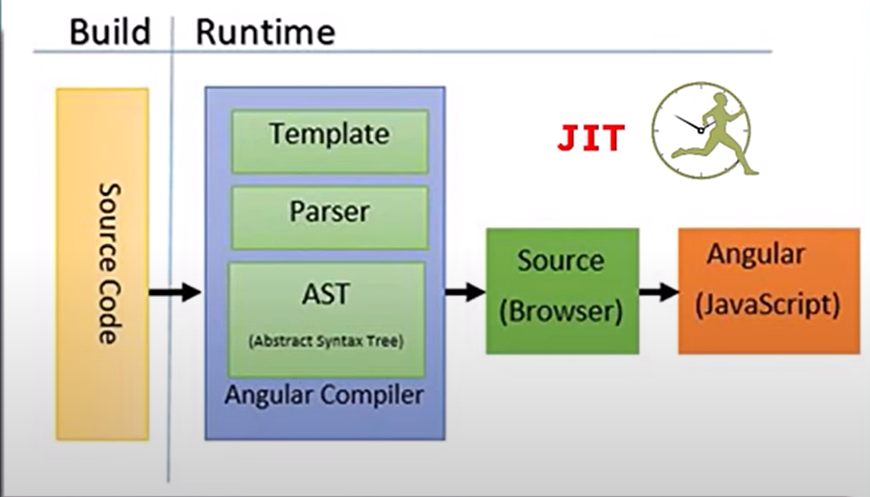
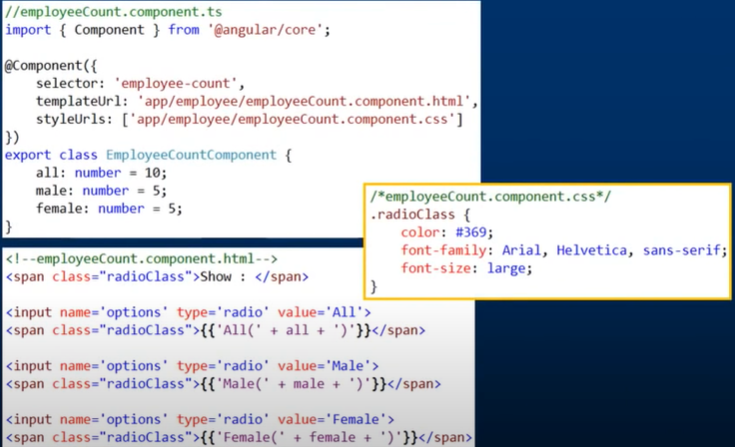

#Angular Questions and Answers

## Q1. Latest version of Angular ?  Some times they may ask the comparison between two versions which you have used

The latest stable version of Angular was **Angular 13**, which was released in November 2022

- When you're dealing with migration between two versions of a framework like Angular, it's essential to understand the changes introduced in each version. Angular provides release notes for each version, and these release notes can help you identify breaking changes, new features, and other modifications.

- Here are the general steps you can follow to compare two versions of Angular for migration purposes:

1. **Review Release Notes:**
   - Visit the official Angular GitHub repository or the Angular website.
   - Look for the release notes section or release announcements.
   - Read the release notes for the specific versions you are comparing.
   - Pay attention to the "Breaking Changes" section, as this will highlight any changes that might impact your existing code.

2. **Check the Changelog:**
   - In addition to release notes, explore the changelog for each version.
   - The changelog provides a detailed list of changes, bug fixes, and enhancements made in each release.

3. **Use Migration Guides:**
   - Angular often provides migration guides for major version upgrades.
   - Check for migration guides relevant to the versions you are moving from and to. These guides offer step-by-step instructions for updating your code.

4. **Check Deprecated Features:**
   - If any features or APIs are deprecated in the older version, check whether they have been removed or replaced in the newer version.
   - Update your code to use the recommended alternatives.

5. **Use Tools for Automated Checks:**
   - Consider using tools like `ng update` provided by the Angular CLI to automate some of the update tasks.
   - The Angular Update Guide (https://update.angular.io/) is a helpful online tool that provides guidance on updating Angular projects between different versions.

6. **Test Your Application:**
   - Set up a test environment and migrate a copy of your application.
   - Test thoroughly to ensure that the application behaves as expected with the new version.
   - Pay special attention to any areas identified in the release notes as potential breaking changes.

7. **Check Third-Party Dependencies:**
   - If your project relies on third-party libraries or modules, check their documentation and release notes for compatibility with the target Angular version.


**Note:** Remember that migration steps may vary based on the specifics of your application and the changes introduced in the versions you're migrating between. Always make sure to back up your codebase before performing any significant updates, and follow best practices for version control to track changes effectively.

---
## Q2. What is Angular CLI

- The Command Line Interface.
- It is a tool provided by the Angular framework to simplify and automate common development tasks.
- It allows developers to __create, build, test, and manage__ Angular projects more efficiently.
- With commands like,
  - 'ng new' for project creation
  - 'ng generate' for code scaffolding
  - 'ng server' inclues development server that allows you to run your application locally
  - 'ng test' for testing

---
## Q3. Angular Lifecycle hooks

- In Angular, think of a component's lifecycle like its `journey` from being born/created to being removed.
- Along this journey, Angular provides specific points where you can do certain things.
- These points are the lifecycle hooks. 
- For example, 
  - When the component is created, you can set it up with __ngOnInit()__. 
  - If it has data that might change, __ngOnChanges()__ lets you react to those changes. 
  - And before saying goodbye, you get a chance to clean up any mess with __ngOnDestroy()__
- These hooks give you control over what happens at different stages of a component's life.
 
Here are the main lifecycle hooks in Angular:

1. __ngOnChanges():__

    - `Called before ngOnInit()`
    - This hook is called when an (data-bound) `input property` of the component changes.
    - It receives a SimpleChanges object containing the previous and current values of the input properties.
    - Called **multiple times** only if input property changes.
    - NOTE: 
      - If your component has `no inputs` or you use it without providing any inputs, the framework `will not` call ngOnChanges().
      - This happens frequently, so any operation you perform here impacts `performance` significantly.

2. __ngOnInit():__

    - This hook is called once when the `component is initialized`.
    - ngOnInit signals the activation of the created component.
    - It is commonly used for `initializing data, making API calls, or performing other setup tasks`.
    - ngOnInit **`called only once`** during lifecycle

3. ngDoCheck():
    - Called immediately after ngOnChanges() on every change detection run, 
    - For the first time of initialization of application, immediately after ngOnInit().
      - ngOnChanges() -> ngOnInit -> ngDoCheck()

4. ngAfterContentInit():

    - This hook is called once after the component's content has been initialized.
    - Respond after Angular projects external content into the component's view
    - It is used when a component has projected content (content projection using <ng-content>).
    - Called once after the `first ngDoCheck()`.

5. ngAfterContentChecked():

    - This hook is called after every check of the component's content.
    - It is used for additional checks or operations after the content is updated.
    - Called after ngAfterContentInit() and every subsequent ngDoCheck().

6. ngAfterViewInit():

    - This hook is called once after the component's view and its child views are initialized.
    - It is often used when you need to `interact with the DOM or perform operations that depend on the component's view`.
    - Called once after the first ngAfterContentChecked()

7. ngAfterViewChecked():

    - This hook is called after every check of the component's view and its child views.
    - It can be used for additional checks or operations after the view is updated.
    - Called after the ngAfterViewInit() and every subsequent ngAfterContentChecked()

8. __ngOnDestroy():__

    - This hook is called just before the component/directive is destroyed.
    - It is used for cleanup tasks, such as unsubscribing from observables to prevent memory leaks.

---
## Q4. Constructor and NgOnInit and it's differences

```
export class App implements OnInit{
  constructor(private myService: MyService){
     //called first time `before` the ngOnInit()
  }

  ngOnInit(){
     //called `after` the constructor and called  after the first ngOnChanges()
     //e.g. http call...
  }
}
```
- The `Constructor` is a default method of the class that is executed when the class is instantiated.
- The constructor should only be used to initialize class members but shouldn't do actual "work". 
- Constructor is widely used to `inject dependencies(services)` into the componenet class.
- `ngOnInit` is an Angular lifecycle hook, specifically designed for Angular components.
- Mostly we use ngOnInit for initialization logic, such as making HTTP requests, initializing component properties based on input values, or performing other setup tasks. and avoid stuff to work in the constructor. 
---
## Q5. What is HttpClient in angular?
- This client is available from `@angular/common/http` package.
```
import { HttpClientModule } from '@angular/common/http;'
```
- It is a service for making HTTP requests to a server. 
- It's helps your Angular application communicate with a backend. 
- With HttpClient, you can easily fetch data, send data, and handle responses from a server. 
- It's a crucial part of building modern web applications that need to interact with servers to get or send data.

**Key features and functionalities of HttpClient include: -**

1. Making HTTP Requests:

  - HttpClient provides methods for making various types of HTTP requests, such as GET, POST, PUT, DELETE, etc.
Example of making a GET request:

```
import { HttpClient } from '@angular/common/http';

constructor(private http: HttpClient) { }

fetchData() {
  return this.http.get('https://api.example.com/data');
}
```
2. Handling Responses:

- HttpClient returns an observable for handling asynchronous responses. Developers can subscribe to these observables to receive and process the data.
```
fetchData() {
  this.http.get('https://api.example.com/data').subscribe(
    (data) => {
      // Handle successful response
      console.log(data);
    },
    (error) => {
      // Handle error
      console.error(error);
    }
  );
}
```
3. Request Configuration:

- HttpClient allows you to configure requests with options like headers, query parameters, and more.
```
const options = {
  headers: new HttpHeaders({
    'Content-Type': 'application/json',
    'Authorization': 'Bearer ' + authToken
  })
};

this.http.post('https://api.example.com/submit', data, options);
```
4. Interceptors:

- Interceptors can be used with HttpClient to intercept and modify HTTP requests or responses globally. This is useful for tasks like adding authentication headers or handling errors.
5. Typed Responses:

- HttpClient supports the ability to define the expected type of the response using generics, making it easier to work with strongly-typed data.
```
interface UserData {
  name: string;
  email: string;
}

this.http.get<UserData>('https://api.example.com/user').subscribe(user => console.log(user));
```
6. Testing:

- HttpClientTestingModule is provided in Angular for testing HTTP requests and responses in a controlled environment.
---
## Q6. Explain on how to use `HttpClient` with an example?

Below are the steps need to be followed fot the usage of `HttpClient`

1. Import `HttpClient` into root module:
```
import { HtttpClientModule } from '@angular/common/http'

@NgModule({
  imports: [
    BrowserModule,
    //Import HttpClientModule after BrowserModule
    HttpClientModule,
  ],
.......
})

export class AppModule {}
```

2. Inject the `HttpClient` into the application: Let's create a userProfileService(userProfile.servie.ts) as an example. It also defines get method of HttpClient:
```
import { Injectable } from '@angular/core';
import { HttpClient } from '@angular/common/http';

const userProfileUrl: string = 'assests/data/profile.json';

@Injectable()
export class UserProfileService {
  constructor(private http: HttpClient) {}

  getUserProfile(){
    return this.http.get(this.userProfileUrl);
  }
}
```

3. Create component for subscribing service: Let's create a component called UserProfileComponent(userprofile.component.ts), which injects UserProfileService and invokes the service method:

```
fetchUserProfile(){
  this.userProfileService.getUserProfile()
  .subscribe(
    (next: User) => this.user = {
      id: data['userid'],
      name: data['name']
    }
  )
}
```
- Since the above service method returns an Observable which needs to be subscribed in the component.
---
## Q7. What is Observables? subscribe and unsubscribe from Observables

### [Observables](https://rxjs.dev/guide/observable)

```
import { Observable } from 'rxjs'

const myObservable = new Observable(observer => {
  observer.next('Hello');
  observer.next('World');
  observer.complete();
});
```

- In Angular, we use Observables to handle things that might take time, like getting data from the internet.
- Basically it Used to perform async operations and handle async data.
- `rxjs` (Reactive Extension for JavaScript) library is commonly used in Angular for working with observables.
- It is representation of stream of data
- It can emit data over time.
- Observables can be used to handle events, handle async operations and manage data streams.

In real world example,
- Think of an Observable like a `magic mailbox`. 
- This mailbox can send you messages over time. 
- You can sit there and wait for new messages. 
- When a message arrives, you react to it—maybe you laugh, maybe you cry.

- Now, `subscribing to an Observable` is like checking your mailbox regularly. 
- You're saying, 'Hey, if there's a new message, let me know, and I'll react to it.' 
- If you get tired of waiting or you don't want messages anymore, you can `unsubscribe`. It's like saying, 'Okay, magic mailbox, I'm done listening for now.'

### Subscribe
- To listen observables and react to the data it emits, you can use `subscribe` method.
- The `subscribe` method takes one or more functions as arguments. These functions define what should happen when the observable emits a new value, encounters an error or completes.
- Example:
```

const subscription = myObservable.subscribe(
  next => console.log(next),         // Next function
  error => console.error(error),       // Error function
  () => console.log('Observable completed')  // Complete function
);
```
or
```
const subscription = myObservable.subscribe({
  next(value) { console.log(next) },
  error(err) { console.log(err) },
});
```
### Unsubscribe
- It's recommended to unsubscribe the observable to prevent `memory leaks`.
- The subscribe method returns a subscription object. Calling the unsubscribe method on this object terminates the subscription and cleans up resources.
```
import { Observable } from 'rxjs';

const myObservable = new Observable(observer => {
  const intervalId = setInterval(() => {
    observer.next('Hello');
  }, 1000);

  // Cleanup logic when unsubscribed
  return () => {
    clearInterval(intervalId);
    console.log('Observable unsubscribed');
  };
});

const subscription = myObservable.subscribe(value => console.log(value));

// Later, when you want to unsubscribe
subscription.unsubscribe();
```
---
## Q8. Promise vs Observable

Reference: https://www.youtube.com/watch?v=Wz8X4YBrMoI&list=PLbDH2D6bQCl1lCLachXihVpxsFMktiT6S

---
## Q9. JIT and AOT compilation? And may be it's advantages

### JIT
- Just in Time compiler
- JIT compiles the application in the browser at `runtime`

 

- Here we have build and runtime environment.
- In the build environment we are having source code, we are not compiling the code here.
- We are sending code to the browser and this runtime environment happening on browser side.
- At browser side, JIT comiler compiles the code and convert it into Javascript in order to reder. 

### AOT
- Ahead of Time Compiler
- AOT compiles the application at `build` time

 

- Here angular code will compiles the code at build time.
- Once code is build, then after that build code goes to browser to rednder. 

### Difference

No.|JIT|AOT|
--- | --- | ---
1|Compile at runtime in the browser|Compile at build time|
2|Larger angular bundle file size|Smaller angular bundle file size|
3|Detect template error at runtime|Detect template errors at compile time|
4|Good for Development|Good for production|
5|ng serve|ng build --aot or ng build --prod|
6|Less security and Performance|Better security and Performance|

__Note:__
- Reference: https://www.youtube.com/watch?v=nq5z5YZHAKE
---
## Q.9 What is rxJS and their behavior?

- RxJS, or Reactive Extensions for JavaScript
- It is a library that provides a set of tools for reactive programming using Observables.
- Using this library you can work with asynchronous data streams.

### Key Concepts in RxJS:

1. Observables:
    - Observables represent a stream of data or events that can be observed over time.
    - They can emit multiple values asynchronously and are a fundamental part of RxJS.
2. Observers:
    - Observers subscribe to Observables to receive notifications when new data is emitted.
    - Observers consist of three callbacks: next (handles new values), error (handles errors), and complete (handles the completion of the Observable).
3. Operators:
    - Operators are functions that can be applied to Observables to transform, filter, or combine the data emitted by them.
    - Examples: map, filter, merge, switchMap, etc.
4. Subscription:
    - A Subscription represents the execution of an Observable and manages the disposal of resources when the Observer no longer needs the data.

### Behavior of RxJS:
- Asynchronous Data Handling
- Event Handling
- Error Handling
---
## Q.10 Eager and Lazy loading in angular?

- Eager Loading:
  - When the application starts, eager loading `loads the entire app upfront`, including all its features and components.
  - Example, In our cooking app, if all the recipes for appetizers, main courses, and desserts are loaded as soon as you open the app, it's using eager loading. 
  - This ensures everything is ready, but it might take longer to start.  
- Lazy loading:
  - Instead of loading the entire application at once, lazy loading `loads specific parts of the application` only when the user navigates to them.
  - Examople, Imagine you're using a cooking app, and the recipes for desserts are loaded only when you click on the "Desserts" section. 
  - Lazy loading helps make your app faster by loading only what's necessary when it's needed.

---
## Q.11 What is NgModule?

- NgModule is a way of organizing and grouping related components, directives, pipes and services in an Angular application.

- Suppose we have a basic application with a component, a service, and a module.

1. Create a Component:

```
// app.component.ts
import { Component } from '@angular/core';

@Component({
  selector: 'app-root',
  template: '<h1>Hello, {{ name }}!</h1>',
})
export class AppComponent {
  name = 'Angular';
}
```
2. Create a Service:

```
// greeting.service.ts
import { Injectable } from '@angular/core';

@Injectable({
  providedIn: 'root',
})
export class GreetingService {
  getGreeting(): string {
    return 'Welcome to Angular World!';
  }
}

```
3. Create an NgModule:
```
// app.module.ts
import { NgModule } from '@angular/core';
import { BrowserModule } from '@angular/platform-browser';

import { AppComponent } from './app.component';
import { GreetingService } from './greeting.service';

@NgModule({
  declarations: [
    AppComponent,
  ],
  imports: [
    BrowserModule,
  ],
  providers: [
    GreetingService,
  ],
  bootstrap: [AppComponent],
})
export class AppModule { }

```
In this example:
- The `AppComponent` is a simple component displaying a greeting.
- The `GreetingService` is a service providing a method to get a greeting message.
- The `AppModule` is the main module of the application.
  - It declares the `AppComponent` in the `declarations` array.
  - It imports the `BrowserModule` in the `imports` array.
  - It provides the `GreetingService` in the `providers` array.
  - It specifies that the `AppComponent` should be bootstrapped in the bootstrap array.
---

## Q12. Var and Let

- let
    - `Block-scoped`: Variables declared with let are accessible to the block (enclosed in curly braces) where they are defined.
    - Cannot be redeclared within the same scope.
    - Hoisted to the top of the block but not initialized until the declaration is encountered.
- var
    - `Function-scoped`: Variables declared with var are visible throughout the entire function.
    - Can be redeclared within the same scope.
    - Hoisted to the top of the function and initialized.
```
fuction example(){
  if(true)
  {
    var x = 10;
    let y = 20;

    console.log(x);  //10
    console.log(y);  //20
  }

  console.log(x);  //10
  // console.log(y);  // ReferenceError: y is not defined
}
```
Note: 
- In modern JavaScript, it is generally recommended to use `let and const` over `var` due to their block-scoping behavior, which helps prevent certain types of bugs and makes code more predictable. 
- `const` is used for constants, and `let` is used for variables whose values can be reassigned.

---

## Q13. Angular dependency injection?

Reference: https://www.youtube.com/watch?v=jWODteEGQmw


- In above example, EmployeeService is responsible for fetching all the data, we could resue this in other component. 
- We are not creating instance of EmployeeService. We are only initializing private field and assign it in constructor. 
- We are not using new keyword. So questions is how we are getting the instace of EmployeeService.

```
export class EmployeeListComponent implements OnInit{
  private _empService: EmployeeService;

  constructor(_empService: EmployeeService){
    this._empService = _empService;
  }

  ngOnInit(){
    this._empService.getEmployees()
        .subscribe(
          (next) => this.employees = next;
          (error) => this.message = 'Error';
        )
  }
}
```
- Who is creating and providing an instance to the Component?
    - `Angular injector`
    - When an instance comopnent is created Angular injector create an instacne of EmployeeService and injects that into the constructor

- How does the angular injector knows about EmployeeService?     
    - By register a service within the angular injector we could use `providers` property of `NgModule` or `Component` decorator.
    - Register at module level or component level


---

## Q14. Component in Angular
```
import { Component }`angular/core`;

@Component({
  selector: 'my-app',
  template: `Hello My World!!!`
})

export class AppComponent{
  name: string = 'Angular';
}
```


---

## Q15. Data Binding / Angular Interpolation

- Data Binding ways:
  - One way data-binding
    - From component to view template
  - One way data-binding
    - From view template to component
  - Two way data-binding
    - From component to view and vice versa.

- `One way data binding` from component to view can be achieved using `Angular Interpolation.`

- `One way data-binding` - From `Component to View Template` : To display read-only data on a view template we use one-way data binding technique `interpolation`. 
  - With interpolation, we place the component property name in the view template, enclosed in double curly braces: {{propertyName}}.

Example:
- In the following example, Angular pulls the value of the firstName property from the component and inserts it between the opening and closing [h1] element.

```
import { Component } from '@angular/core';

@Component({
  selector: 'my-app',
  template" `<h1>{{ firstName }}</h1>`
})

export class AppComponent{
  firstName: string = "Sagar";
}
```

- You can specify any valid expression in double curly braces. For example you can have
``` 
[h1]{{ 10 + 20 + 30 }}[/h1]
```
- The expression that is enclosed in double curly braces is commonly called as Template Expression. This template expression can also be a ternary operator as shown in the example below. Since firstName property has a value 'Tom', we see it in the browser.
```
import { Component } from '@angular/core';

@Component({
    selector: 'my-app',
    template: `
                [h1]{{firstName ? firstName : 'No name specified'}}[/h1]
              `
})
export class AppComponent {
    firstName: string = 'Tom';
}
```

## Property Binding

- Both Interpolation and Property binding flows a value in one direction, i.e from a `component's data property into a target element property`.
- Interpolation is just a convenient alternative to property binding. 
- 
In some cases like when we need to concatenate strings we have to use interpolation instead of property binding as shown in the example below.
- When setting an element property to a `non-string data` value, you must use `property binding`. 
  - In the following example, we are disabling a button by binding to the boolean property isDisabled.
  ```
  [button [disabled]='isDisabled']Click me[/button]
  ```
- If we use interpolation instead of property binding, the button is `always disabled` irrespective of isDisabled class property value
```
[button disabled='{{isDisabled}}']Click me[/button]
```

```
[img src='http://www.pragimtech.com/{{imagePath}}' /]
```


## Html Attributes vs DOM


## What is Attribute Binding
- Interpolation and Property binding deal with binding Component class properties to HTML element properties and `NOT ATTRIBUTES`
- But not all HTML element attributes have corresponding properties. For example,`coslpan` attribute does not have a corresponding property
- In situations like this we want to be able to bind to HTML element attributes
- Hence, Angular provided Attribute Binding

- Attribute Binding Examples
```
<th [attr.colspan]="columnSpan">

<th attr.colspan="{{columnSpan}}">
```

## CSS Class binding in Angular

```
import { Component } from '@angular/core';

@Component({
    selector: 'my-app',
    template: `
                [button class='colorClass' [class]='classesToApply']My Button[/button]
              `
})
export class AppComponent {
    classesToApply: string = 'italicsClass boldClass';
}
```
Run the application and notice 'colorClass' is `removed` and these classes (italicsClass & boldClass) are added.


**ngStyle**

- To set multiple inline styles use `NgStyle` directive
```

import { Component } from '@angular/core';

@Component({
    selector: 'my-app',
    template: ` [button style='color:red' [ngStyle]="addStyles()"]My Button[/button]
                    `
})
export class AppComponent {
    isBold: boolean = true;
    fontSize: number = 30;
    isItalic: boolean = true;

    addStyles() {
        let styles = {
            'font-weight': this.isBold ? 'bold' : 'normal',
            'font-style': this.isItalic ? 'italic' : 'normal',
            'font-size.px': this.fontSize
        };

        return styles;
    }
}
```

Note: These bindings flow data in one direction i.e from a component class property to an HTML element property.
- Interpolation
- Property Binding
- Attribute Binding
- Class Binding
- Style Binding

- How about flowing data in the opposite direction i.e `from an HTML element to a component`. 
    - When a user performs any action like clicking on a button, hovering over an element, selecting from a dropdownlist, typing in a textbox etc, then the corresponding event for that action is raised. 
    - We need to know when user performs these actions. 
    - We can use angular event binding to get notified when these events occur.

## Event Binding

- It flows data in the opposite direction .i.e from an HTML element to a component.

```
import { Component } from '@angular/core';

@Component({
  selector: 'my-app',
  template: `<button (click)='onClick()'>Click Me</button>`
})
expoer class AppComponent{
  onClick():void{
    console.log('Button Clicked');
  }
}
```

- Alternate way to write using Canonical syntax:
```
<button on-click="onClick()">Click Me</button>
```

`Another Example` : 

- Initially when the page loads we want to display only the First Name and Last of Employee. We also want to display "Show Details" button.

- When we click "Show Details" button, we want to display "Gender" and "Age" as well. The text on the button should be changed to "Hide Details". When we click "Hide Details" button, "Gender" and "Age"  should be hidden and the button text should be changed to "Show Details".

To achieve this we will make use of `event binding` in Angular. We will also make use of one of the structural directives `"ngIf"` in angular.


## Two way data binding

- This is combination of `event bindig` and `data binding`.
- Syntax for using two-way data binding,
```
<input [(ngModel)]='name'>
```
  - Square brackets on the outside are for property binding.
  - Parentheses on the inside are for event binding.

- Import `ngModel` directive from Angular system module called `FormsModule`

````
import { FormsModule } from '@angular/forms';

@NgModule({
  imports : [BrowserModule,FormsModule],
  declarations: [AppComponent],
  bootstrap: [AppComponent]
})

export class AppModule{}
````

---
### *ngFor
 
- ngFor directive may perform poorly with large lists
- A small change to the list may trigger a cascade of DOM manipulations
```
<tr *ngFor='let employee of employees; trackBy:trackByEmpCode'>

trackByEmpCode(index: number, employee: any): string {
return employee.code;

To get the index of an item in a collection
<tr *ngFor='let employee of employees;
<td>{{employee.code}}</td>
<td>{{employee.name}}</td>
<td>{{employee.gender}}</td>
<td>{{employee.annualSalary}}</td>
<td>{{emplovee.dateOfBirth}}</td>
<td>{{i}}</td>
</tr>
```
- Angular can avoid this churn with trackBy. The trackBy function takes the index and the current item as arguments and returns the unique identifier by which that item should be tracked. In our case we are tracking by Employee code. Add this method to employeeList.component.ts. 
```
trackByEmpCode(index: number, employee: any): string {
    return employee.code;
}
```

---

## Q16.  Angular pipes

1. Transform data before display
2. Built in pipes include `lowercase, uppercase, decimal, date, percent, currency` etc
3. To apply a pipe on a bound property use the pipe character ` | `
```
{{employee.code | uppercase}} 
```
4. We can also chain pipes
{{employee.dateOfBirth | date:'fullDate' | uppercase }}

5. Pass parameters to pipe using colon " : "
```
{{employee.annualSalary | currency:'USD':true:'1.3-3'}}
{{employee.dateOfBirth | date:'fullDate'}}
{{employee.dateOfBirth | date:'dd/MM/y'}}
```

### Custom Pipes: (PipeTransform interface)

- Here is what we want to do. Depending on the gender of the employee, we want to display Mr. or Miss. prefixed to the employee name.
- To achieve this let's create a custom pipe called employeeTitlePipe

### Step 1: Create a custom pipe 
```
import {Pipe, PipeTrasform} from '@angular/core';

@Pipe({
  name: 'employeeTitle'
})

export class EmployeeTitlePipe implements PipeTrasnform{
  trasform(value: string, gender: string): string{
    if(gender.toLowerCase() == "male")
      return "Mr." + value;
    else
      return "Miss." + value;
  }
}
```
Code Explanation : 
1. Import Pipe decorator and `PipeTransform interface` from Angular core

2. Notice "EmployeeTitlePipe" class is decorated with Pipe decorator to make it an Angular pipe

3. name property of the pipe decorator is set to employeeTitle. This name can then be used on any HTML page where you want this pipe functionality.

4. EmployeeTitlePipe class implements the PipeTransform interface. This interface has one method transform() which needs to be implemented.

5. Notice the transform method has 2 parameters. value parameter will receive the name of the employee and gender parameter receives the gender of the employee. The method returns a string i.e Mr. or Miss. prefixed to the name of the employee depending on their gender.

### Step 2: Declare the custom pipe in the module where you need it.

- Register "EmployeeTitlePipe" in the angular module where we need it. In our case we need it in the root module. So in app.module.ts file, import the EmployeeTitlePipe and include it in the "declarations" array of NgModule decorator
```
import { EmployeeTitlePipe } from './employee/employeeTitle.pipe'

@NgModule({
    imports: [BrowserModule],
    declarations: [AppComponent, EmployeeComponent, EmployeeListComponent, EmployeeTitlePipe],
    bootstrap: [AppComponent]
})
export class AppModule { }
```

Step 3 : Use the custom pipe just like any other build in angular pipe

- In "employeeList.component.html" use the "EmployeeTitlePipe" as shown below. Notice we are passing employee gender as an argument for the gender parameter of our custom pipe. Employee name gets passed automatically.
```
<tr *ngFor='let employee of employees; '>
<td>{{employee.code}}</td>
<td>{{employee.name | employeeTitle:employee.gender
}}</td>
td>{{employee.name
<td>{{employee.gender}}</td>
<td>{{employee.annualSalary}}</td>
<td>{{employee.date0fBirth}}</td>
</tr>
```

---

## Q16. Angular container and nested components

- We will nest EmployeeCountComponent in EmployeeListComponent. So EmployeeCountComponent becomes the `nested component` or `child component` and EmployeeListComponent becomes the `container component` or `parent component`.


Code for above view:




Summary:
 
To nest a component, use the selector of the component that you want to nest as a directive on the container component.
```
  //employeeCount.component.ts
import { Component } from '@angular/core';

@Component({
selector: 'employee-count',
templateUrl: 'app/employee/employeeCount.component.html',
styleUrls: ['app/employee/employeeCount.component.css']

export class EmployeeCountComponent {
all: number = 10;
male: number = 5;
female: number = 5;
```
and in employeeList.component.html use the selector,
```
<employeeleount></employee-count>
```
---

## Q17. Input Properties

- How to pass data from the container(parent) component to the nested(child) component using input properties.

We want the values for these 3 properties to be passed from the container component i.e EmployeeListComponent.
```
export class EmployeeCountComponent {
    all: number = 10;
    male: number = 5;
    female: number = 5;
}
```
So Convert a child component property to an input property using `@Input` decorator:
```
import { Component, Input } from '@angular/core';

@Component({
    selector: 'employee-count',
    templateUrl: 'app/employee/employeeCount.component.html',
    styleUrls: ['app/employee/employeeCount.component.css']
})
export class EmployeeCountComponent {
    @Input()
    all: number;

    @Input()
    male: number;

    @Input()
    female: number;
}
```

Pass data from the parent component to the child component: 
- Need to add below function in Parent EmployeeListComponent  component,
```
getTotalEmployeesCount(): number {
    return this.employees.length;
}

getTotalMaleEmployeesCount(): number {
    return this.employees.filter(e =] e.gender === "Male").length;
}

getTotalFemaleEmployeesCount(): number {
    return this.employees.filter(e =] e.gender === "Female").length;
}
```

Second change is in view template  i.e employeeList.component.html file:
```
[employee-count [all]="getTotalEmployeesCount()"
                [male]="getMaleEmployeesCount()"
                [female]="getFemaleEmployeesCount()"]
[/employee-count]
```

---

## Output properties

How to pass user actions or user entered values or selections

```
// Import Output and EventEmitter
import { Component, Input, Output, EventEmitter } from '@angular/core';

@Component({
    selector: 'employee-count',
    templateUrl: 'app/employee/employeeCount.component.html',
    styleUrls: ['app/employee/employeeCount.component.css']
})
export class EmployeeCountComponent {
    @Input()
    all: number;

    @Input()
    male: number;

    @Input()
    female: number;

    // Holds the selected value of the radio button
    selectedRadioButtonValue: string = 'All';

    // The Output decorator makes the property an Output property
    // EventEmitter class is used to create the custom event
    // When the radio button selection changes, the selected 
    // radio button value which is a string gets passed to the 
    // event handler method. Hence, the event payload is string. 
    @Output()
    countRadioButtonSelectionChanged: EventEmitter[string] = new EventEmitter[string]();

    // This method raises the custom event. We will bind this 
    // method to the change event of all the 3 radio buttons
    onRadioButtonSelectionChange() {
        this.countRadioButtonSelectionChanged.emit(this.selectedRadioButtonValue);
    }
 
```


## What are directive?

-A way to extend and modify the behavior of HTML elements
- Directives are simply an instruction to the DOM i.e. which tells what to add into web page
- Componets are directive but with the view template.
- We have custom directive without an view template.
- Mostly we use directive like an html attribute
- It is a typescript class decorated with `Directive` decorator
```
@Directive({
  selector:'[changeDriven]'
  expoe
})
```
 
`Structural directive:` Changes the view of a webpage by adding or removing DOM elements from a webpage.

```
// Custom structural directive
import { Directive, Input, TemplateRef, ViewContainerRef } from '@angular/core';

@Directive({
  selector: '[appCustomStructural]'
})
export class CustomStructuralDirective {
  @Input() set appCustomStructural(condition: boolean) {
    if (condition) {
      this.viewContainer.createEmbeddedView(this.templateRef);
    } else {
      this.viewContainer.clear();
    }
  }

  constructor(
    private templateRef: TemplateRef<any>,
    private viewContainer: ViewContainerRef
  ) { }
}

In the template:
<div *appCustomStructural="someCondition">This is a custom structural directive.</div>
```

`Attribute Directive:` Used like an attribute on a existing webpage element to change its look and behaviour.

```
//Custom attribute directive

import { Directive, ElementRef, Renderer2 } from '@angular/core';

@Directive({
  selector: '[appCustomAttribute]'
})
export class CustomAttributeDirective {
  constructor(private el: ElementRef, private renderer: Renderer2) {
    this.renderer.setStyle(this.el.nativeElement, 'font-weight', 'bold');
  }
}

In the template:
<p appCustomAttribute>This is a custom attribute directive.</p>

```

---

## Single page applications

- A Single Page Application, or SPA, is a type of web application that delivers a seamless and responsive user experience by dynamically updating the current page instead of loading entire new pages from the server. 
- Key characteristics of SPAs include 
  - dynamic content loading
  - smooth user experience
  - client-side routing
  - rich interactivity
  - RESTful API integration
  - initial loading and caching
  - cross-browser compatibility
  - state management

---


## What is Service in Angular?

- A service in Angular is generally used when you need to `reuse data or logic` across multiple components.
- Anytime you see logic or data-access duplicated across multiple components, think about refactoring that piece of logic or data-access code into a service.
- Using a service ensures we are not violating one of the Software principles - DRY ((Don't repeat yourself)- The logic or data access is implemented once in a service, and the service can be used across all the components in our application.
- Without the service you would have to repeat your code in each component.

here is the employee service


Here is component which consumes the service.


---


## Routing tutorial: 

- Routing allows users to navigate from one view to another view.

- Here are the steps to implement routing in Angular  applications.

Step 1 : Set [base href] in the application host page which is index.html. The [base href] tells the angular router how to compose navigation URLs.

[base href="/src/"]

Step 2 : In our angular application root module (app.module.ts), import RouterModule and Routes array and define routes as shown below.

```
import {RouteModule, Routes } from '@angular/router';

// Routes is an array of Route objects
// Each route maps a URL path to a component
// The 3rd route specifies the route to redirect to if the path
// is empty. In our case we are redirecting to /home
// The 4th route (**) is the wildcard route. This route is used
// if the requested URL doesn't match any other routes already defined
const appRoutes:Routes = [
  { path:'home', component: HomeComponent},
  { path:'employees', component: EmployeeListComponent },
  { path:'', redirectTo:'/home', pathMatch='full'},
  { path:'**', component: PageNotFoundComponent}
];

@NgModule({
  imports:[
    BrowserModule, FormsModule, HttpModule,
    RouterModule.forRoot(appRoutes)
  ],
  declarations:[AppComponent, HomeComponent, ..],
  bootstrap: [AppComponent]
})
export class AppModule{}
```
---
## RxJS Subjects

Reference: https://www.javatpoint.com/rxjs-subjects

- An RxJS Subject is like an Observable. It is a special type of Observable that allows values to be multicasted to many Observers
- Subjects are like EventEmitters: they maintain a registry of many listeners
- An RxJS subject can be subscribed to, just like we usually do with Observables. It also has methods such as next(), error() and complete(), which we have already seen and used in our Observable creation function.
- The main difference between an Observable and a Subject is that a plain Observable by default is `unicast`. It means that each `subscribed Observer owns an independent execution of the Observable`. On the other hand, Subjects are `multicast`. A Subject is like an Observable, but it can multicast to many Observers.

### Types of RxJS Subjects

- `Subject` - This is the standard RxJS Subject. It doesn't have any initial value or replay behavior.
- `BehaviorSubject` - This variant of RxJS subject requires an initial value and emits its current value (last emitted item) to new subscribers.
- `ReplaySubject` - This variant of RxJS subject is used to emit a specified number of last emitted values (a replay) to new subscribers.
- `AsyncSubject` - The AsyncSubject emits the latest value to observers upon completion.

---

